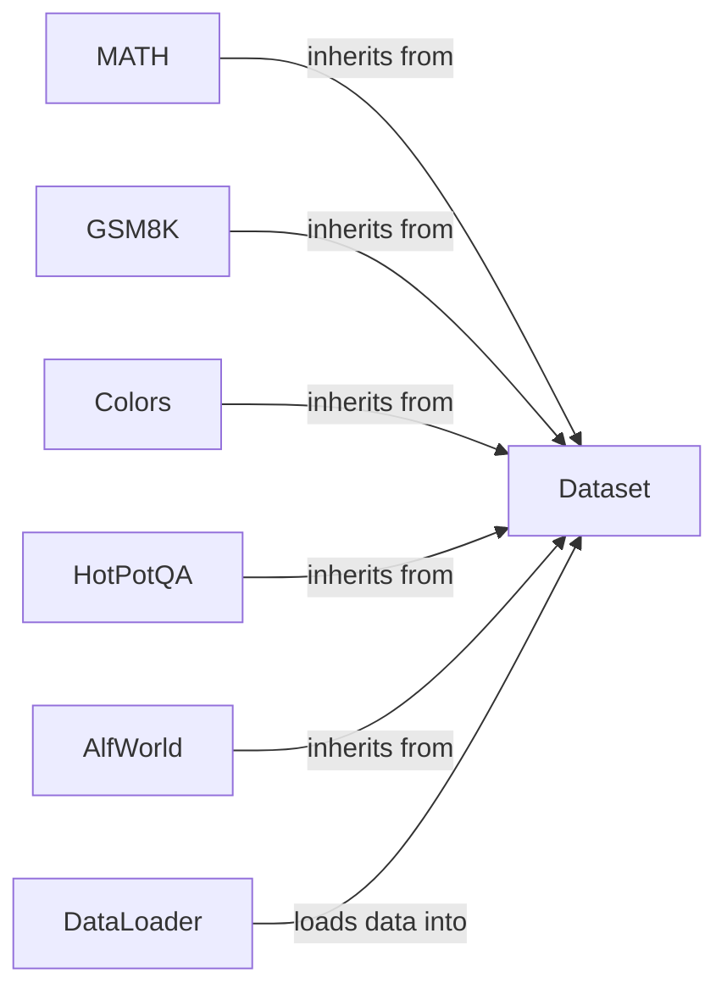

## Component Details

The Data Management component in DSPy provides a set of tools for loading, processing, and managing datasets used for training and evaluating DSPy programs. It offers a unified interface for accessing data from various sources, including local files and Hugging Face datasets. The core functionality revolves around the `Dataset` class, which serves as the base class for all datasets, and the `DataLoader` class, which handles the loading and conversion of data into `Dataset` objects. Specific dataset classes like `MATH`, `GSM8K`, `Colors`, `HotPotQA`, and `AlfWorld` provide standardized access to commonly used datasets, each tailored to its specific data format and evaluation metrics. This component streamlines the data preparation process, making it easier for users to work with different datasets in a consistent manner.

### Dataset
The `Dataset` class serves as the foundation for all datasets within DSPy. It provides core functionalities for data manipulation, including splitting the dataset into training, validation, and testing subsets, shuffling the data to ensure randomness, and preparing the data for consumption by DSPy modules. All specific dataset implementations inherit from this base class, ensuring a consistent interface for data access and manipulation.
- **Related Classes/Methods**: `dspy.datasets.dataset.Dataset`

### DataLoader
The `DataLoader` class is responsible for loading datasets from various sources, such as CSV files, JSON files, Pandas DataFrames, Hugging Face datasets, Parquet files, and RM datasets. It transforms the loaded data into a `Dataset` object, making it compatible with DSPy's data processing pipeline. The `DataLoader` abstracts away the complexities of data loading and formatting, providing a simple and unified interface for accessing data from different sources.
- **Related Classes/Methods**: `dspy.datasets.dataloader.DataLoader`

### MATH
The `MATH` dataset class provides a standardized way to access and utilize the MATH dataset within DSPy. It inherits from the base `Dataset` class and offers specific functionalities or configurations tailored to the MATH dataset's structure and requirements. This ensures that the MATH dataset can be seamlessly integrated into DSPy programs.
- **Related Classes/Methods**: `dspy.datasets.math.MATH`

### GSM8K
The `GSM8K` dataset class provides a standardized way to access and utilize the GSM8K dataset within DSPy. It inherits from the base `Dataset` class and includes a metric function (`gsm8k_metric`) for evaluating performance on this dataset. This ensures that the GSM8K dataset can be seamlessly integrated into DSPy programs and evaluated effectively.
- **Related Classes/Methods**: `dspy.datasets.gsm8k.GSM8K`, `dspy.datasets.gsm8k.gsm8k_metric`

### Colors
The `Colors` dataset class provides a standardized way to access and utilize the Colors dataset within DSPy. It inherits from the base `Dataset` class and offers specific functionalities or configurations tailored to the Colors dataset's structure and requirements. This ensures that the Colors dataset can be seamlessly integrated into DSPy programs.
- **Related Classes/Methods**: `dspy.datasets.colors.Colors`

### HotPotQA
The `HotPotQA` dataset class provides a standardized way to access and utilize the HotPotQA dataset within DSPy. It inherits from the base `Dataset` class and offers specific functionalities or configurations tailored to the HotPotQA dataset's structure and requirements. This ensures that the HotPotQA dataset can be seamlessly integrated into DSPy programs.
- **Related Classes/Methods**: `dspy.datasets.hotpotqa.HotPotQA`

### AlfWorld
The `AlfWorld` dataset class provides a standardized way to access and utilize the AlfWorld dataset within DSPy. It inherits from the base `Dataset` class and includes environment interaction functionalities, allowing DSPy programs to interact with the AlfWorld environment. This enables the development of DSPy programs that can reason and act within the AlfWorld environment.
- **Related Classes/Methods**: `dspy.datasets.alfworld.alfworld.AlfWorld`, `dspy.datasets.alfworld.alfworld.EnvPool`
