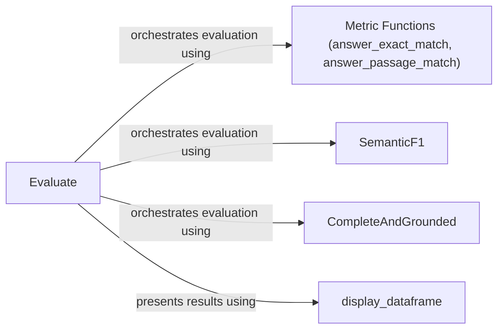

## Component Details

The Evaluation and Performance Monitoring component in DSPy provides a comprehensive suite of tools for assessing the quality and effectiveness of DSPy programs. It encompasses functionalities for defining custom metrics, executing evaluations on datasets, and leveraging automated LM-based evaluation methods. The primary goal is to ensure program reliability and offer actionable insights for continuous improvement and optimization.

### Evaluate
The Evaluate class serves as the central orchestrator for the evaluation process. It takes a DSPy predictor (module), a dataset, and a set of evaluation metrics as input. It then iterates through the dataset, applies the predictor to each data point, calculates the specified metrics by comparing the predictor's output to the ground truth, and presents the results in a structured table format. It relies on various metric components and the display_dataframe function to present the results.
- **Related Classes/Methods**: `dspy.evaluate.evaluate.Evaluate:__call__`, `dspy.evaluate.evaluate.Evaluate:_construct_result_table`, `dspy.evaluate.evaluate.Evaluate:_display_result_table`

### Metric Functions (answer_exact_match, answer_passage_match)
These functions define fundamental metrics for evaluating answer quality. `answer_exact_match` checks if the predicted answer exactly matches the ground truth, while `answer_passage_match` determines if the predicted answer is present within a retrieved context passage. These metrics provide a basic level of assessment for answer correctness and relevance and are used by the Evaluate class.
- **Related Classes/Methods**: `dspy.evaluate.metrics:answer_exact_match`, `dspy.evaluate.metrics:answer_passage_match`, `dspy.evaluate.metrics:_answer_match`, `dspy.evaluate.metrics:_passage_match`

### SemanticF1
The SemanticF1 class implements an automated evaluation metric that leverages semantic similarity to assess answer quality. It compares the predicted answer with the ground truth using a semantic similarity model, calculating an F1 score to quantify the degree of semantic overlap. This metric offers a more nuanced evaluation compared to exact match, capturing semantic equivalence and is used by the Evaluate class.
- **Related Classes/Methods**: `dspy.evaluate.auto_evaluation.SemanticF1:__init__`, `dspy.evaluate.auto_evaluation.SemanticF1:forward`

### CompleteAndGrounded
The CompleteAndGrounded class implements an automated evaluation metric that assesses the completeness and groundedness of generated answers. It checks whether the answer covers all relevant aspects of the question and whether it is adequately supported by the retrieved context. This metric is particularly useful for evaluating the quality of answers generated by retrieval-augmented language models and is used by the Evaluate class.
- **Related Classes/Methods**: `dspy.evaluate.auto_evaluation.CompleteAndGrounded:__init__`, `dspy.evaluate.auto_evaluation.CompleteAndGrounded:forward`

### display_dataframe
The `display_dataframe` function is responsible for presenting the evaluation results in a user-friendly, tabular format using a Pandas DataFrame. It takes the calculated metrics and corresponding data points as input and generates a visually appealing table that facilitates easy interpretation and analysis of the evaluation results. It is used by the Evaluate class to present the results.
- **Related Classes/Methods**: `dspy.evaluate.evaluate:display_dataframe`
