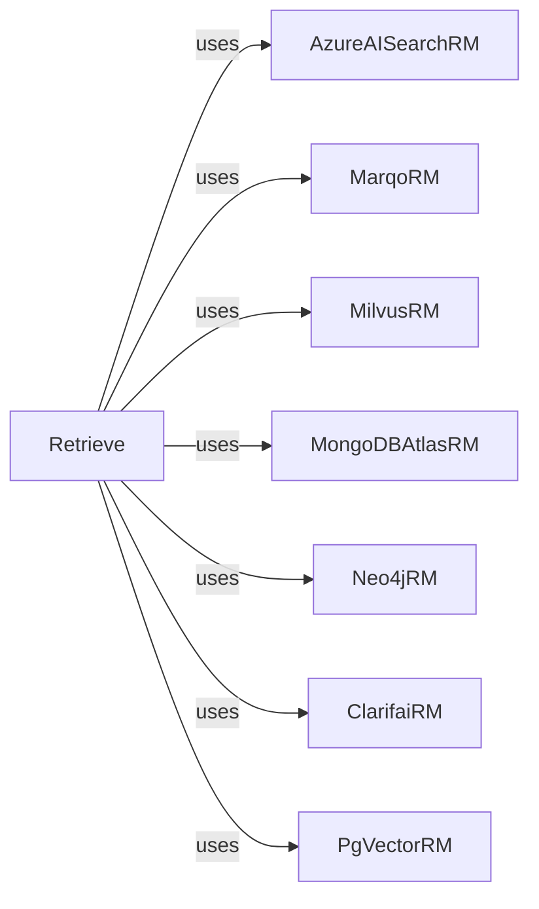

## Component Details

The Knowledge Integration component in DSPy focuses on retrieving relevant information from external sources to enhance program capabilities. The core of this component is the `Retrieve` class, which acts as an orchestrator, taking a query and using various Retriever Modules (RMs) to fetch relevant passages. Each RM is responsible for interacting with a specific external knowledge source, such as vector databases or search engines. The retrieved passages are then returned to the program for further processing, enabling the integration of external knowledge into the program's reasoning and decision-making processes.

### Retrieve
The `Retrieve` class is an abstract component responsible for managing the retrieval process. It takes a query as input and uses one or more Retriever modules to fetch relevant passages. It orchestrates the retrieval process and returns the retrieved passages.
- **Related Classes/Methods**: `dspy.retrieve.retrieve.Retrieve`, `dspy.retrieve.retrieve.Retrieve:__call__`, `dspy.retrieve.retrieve.Retrieve:forward`

### AzureAISearchRM
The `AzureAISearchRM` class is a Retriever module that interacts with Azure AI Search to retrieve relevant passages. It takes a query as input, constructs a search request, and returns the retrieved passages from Azure AI Search.
- **Related Classes/Methods**: `dspy.retrieve.azureaisearch_rm.AzureAISearchRM`, `dspy.retrieve.azureaisearch_rm.AzureAISearchRM:__init__`, `dspy.retrieve.azureaisearch_rm.AzureAISearchRM:azure_search_request`, `dspy.retrieve.azureaisearch_rm.AzureAISearchRM:forward`

### MarqoRM
The `MarqoRM` class is a Retriever module that interacts with Marqo to retrieve relevant passages. It takes a query as input and returns the retrieved passages from Marqo.
- **Related Classes/Methods**: `dspy.retrieve.marqo_rm.MarqoRM`, `dspy.retrieve.marqo_rm.MarqoRM:__init__`, `dspy.retrieve.marqo_rm.MarqoRM:forward`

### MilvusRM
The `MilvusRM` class is a Retriever module that interacts with Milvus to retrieve relevant passages. It takes a query as input and returns the retrieved passages from Milvus.
- **Related Classes/Methods**: `dspy.retrieve.milvus_rm.MilvusRM`, `dspy.retrieve.milvus_rm.MilvusRM:forward`

### MongoDBAtlasRM
The `MongoDBAtlasRM` class is a Retriever module that interacts with MongoDB Atlas Vector Search to retrieve relevant passages. It takes a query as input and returns the retrieved passages from MongoDB Atlas.
- **Related Classes/Methods**: `dspy.retrieve.mongodb_atlas_rm.MongoDBAtlasRM`, `dspy.retrieve.mongodb_atlas_rm.MongoDBAtlasRM:__init__`, `dspy.retrieve.mongodb_atlas_rm.MongoDBAtlasRM:forward`

### Neo4jRM
The `Neo4jRM` class is a Retriever module that interacts with Neo4j to retrieve relevant passages. It takes a query as input and returns the retrieved passages from Neo4j.
- **Related Classes/Methods**: `dspy.retrieve.neo4j_rm.Neo4jRM`, `dspy.retrieve.neo4j_rm.Neo4jRM:__init__`, `dspy.retrieve.neo4j_rm.Neo4jRM:forward`

### ClarifaiRM
The `ClarifaiRM` class is a Retriever module that interacts with Clarifai to retrieve relevant passages. It takes a query as input and returns the retrieved passages from Clarifai.
- **Related Classes/Methods**: `dspy.retrieve.clarifai_rm.ClarifaiRM`, `dspy.retrieve.clarifai_rm.ClarifaiRM:__init__`, `dspy.retrieve.clarifai_rm.ClarifaiRM:forward`

### PgVectorRM
The `PgVectorRM` class is a Retriever module that interacts with PgVector to retrieve relevant passages. It takes a query as input and returns the retrieved passages from PgVector.
- **Related Classes/Methods**: `dspy.retrieve.pgvector_rm.PgVectorRM`, `dspy.retrieve.pgvector_rm.PgVectorRM:__init__`, `dspy.retrieve.pgvector_rm.PgVectorRM:forward`
