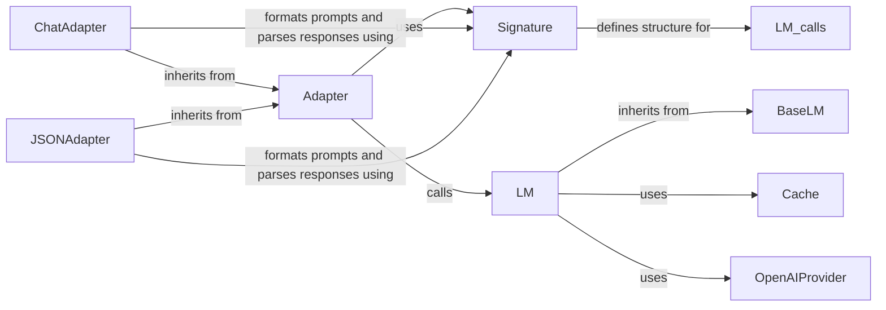

## Component Details

The LM Interaction Management component in DSPy orchestrates communication with various Language Models (LMs). It defines signatures for LM calls using `Signature` and its related classes (`InputField`, `OutputField`), handles API requests through `BaseLM` and its subclasses (`LM`, `OpenAIProvider`, `ArborProvider`, `LocalProvider`), caches responses using `Cache`, and adapts input/output formats using `Adapter` and its subclasses (`ChatAdapter`, `JSONAdapter`, `TwoStepAdapter`). This system abstracts away the complexities of different LM providers, ensuring consistent and reliable LM behavior across diverse platforms.

### Signature
Defines the structure of LM calls, specifying input and output fields. It acts as a contract between DSPy modules and LMs, ensuring that data is formatted correctly for both input and output.
- **Related Classes/Methods**: `dspy.signatures.signature`, `dspy.signatures.field`

### Adapter
Abstract base class responsible for adapting between DSPy Signatures and LM APIs. It handles formatting prompts, parsing responses, and managing conversation history, bridging the gap between DSPy's structured data and the LM's API.
- **Related Classes/Methods**: `dspy.adapters.base`

### BaseLM
Abstract base class for language model clients. It provides a unified interface for calling different LMs, abstracting away the specific API details of each LM provider.
- **Related Classes/Methods**: `dspy.clients.base_lm`

### LM
Base class for language model clients, inheriting from BaseLM. It handles calling LMs, caching responses, and fine-tuning, providing a concrete implementation for interacting with LMs.
- **Related Classes/Methods**: `dspy.clients.lm`

### Cache
Caches LM responses to improve efficiency and reduce API costs. It stores and retrieves LM responses based on the input prompt, avoiding redundant API calls.
- **Related Classes/Methods**: `dspy.clients.cache`

### OpenAIProvider
Client for interacting with the OpenAI API. It implements the BaseLM interface and provides specific methods for calling OpenAI's LMs.
- **Related Classes/Methods**: `dspy.clients.openai`

### ChatAdapter
Adapter specialized for chat-based LM APIs. It formats prompts as chat messages and parses responses accordingly, tailoring the interaction for chat-style LMs.
- **Related Classes/Methods**: `dspy.adapters.chat_adapter`

### JSONAdapter
Adapter that formats prompts and parses responses as JSON objects. It's useful for LMs that work well with structured JSON data.
- **Related Classes/Methods**: `dspy.adapters.json_adapter`
