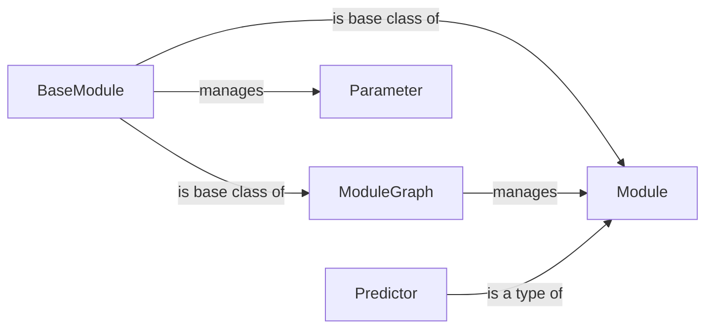

## Component Details

This graph represents the module composition and execution functionality in DSPy. It allows users to define reusable components (Modules) that encapsulate LM calls and other operations. These modules can be composed into complex data processing pipelines, managed by the ModuleGraph. The BaseModule provides the foundation for all modules, handling parameters and state. The flow involves defining Modules, composing them within a ModuleGraph, and then executing the graph to perform the desired data processing tasks.

### BaseModule
The BaseModule class serves as the foundation for all modules within DSPy. It offers core functionalities for managing parameters, submodules, and saving/loading module state. It provides a consistent interface for all module types, enabling modular and reusable component design.
- **Related Classes/Methods**: `dspy.primitives.module.BaseModule`

### Module
The Module class, a subclass of BaseModule, represents a program or a collection of predictors. It provides methods for managing predictors, setting/getting the language model, and defining the forward pass. It is the primary way to define a reusable program in DSPy, encapsulating the logic and parameters for a specific task.
- **Related Classes/Methods**: `dspy.primitives.module.Module`

### ModuleGraph
The ModuleGraph class is designed for managing and organizing modules in a graph structure. It allows adding modules, processing submodules, and defining the connections between them. This enables the creation of complex, modular programs by connecting individual modules and managing the data flow between them.
- **Related Classes/Methods**: `dspy.experimental.module_graph.ModuleGraph`

### Parameter
The Parameter class represents a configurable parameter within a module. It allows users to define and manage the parameters that control the behavior of a module. Parameters can be set, retrieved, and updated, enabling dynamic configuration of modules.
- **Related Classes/Methods**: `dspy.primitives.module.Parameter`

### Predictor
The Predictor class is a specialized type of Module that is designed to make predictions. It typically encapsulates a language model call and provides methods for formatting the input and output. Predictors are used as building blocks for more complex programs.
- **Related Classes/Methods**: `dspy.primitives.module.Predictor`
