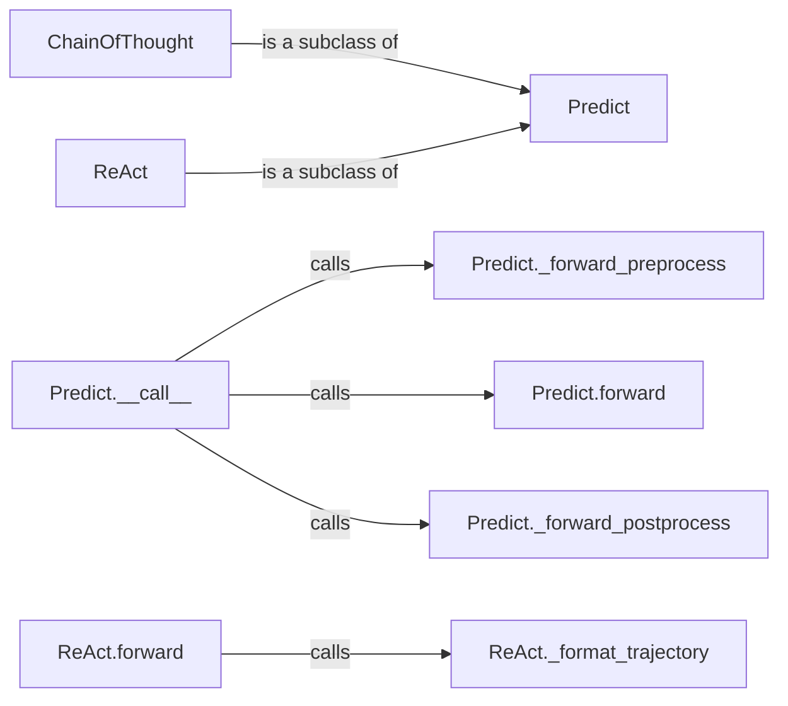

## Component Details

The Prediction Strategies component in DSPy provides a flexible framework for generating predictions using language models. It revolves around the `Predict` class, which serves as a base for different prediction strategies. Subclasses like `ChainOfThought` and `ReAct` implement specific prompting and reasoning techniques. The core prediction logic is encapsulated in the `forward` method, which is customized by subclasses. The `__call__` method orchestrates the prediction process, including preprocessing and postprocessing. This system allows DSPy to easily incorporate and experiment with various LM-based prediction approaches.

### Predict
The `Predict` class is the foundation for all prediction strategies in DSPy. It defines the basic structure for making predictions, including methods for preprocessing, the forward pass (prediction logic), and postprocessing. It also handles state management, allowing predictors to be saved and loaded. Subclasses override the `forward` method to implement specific prediction strategies.
- **Related Classes/Methods**: `dspy.predict.predict.Predict`

### ChainOfThought
The `ChainOfThought` class extends `Predict` to implement chain-of-thought reasoning. It generates intermediate reasoning steps to improve prediction accuracy. This class provides a structured way to guide the language model through a series of logical steps before arriving at the final answer.
- **Related Classes/Methods**: `dspy.predict.chain_of_thought.ChainOfThought`

### ReAct
The `ReAct` class extends `Predict` to implement the ReAct (Reasoning and Acting) paradigm. It enables the language model to interact with an environment by alternating between reasoning and action steps. This allows the model to gather information and refine its predictions based on real-world feedback.
- **Related Classes/Methods**: `dspy.predict.react.ReAct`

### Predict.__call__
The `__call__` method is the main entry point for making predictions using a `Predict` object. It orchestrates the entire prediction process, calling the `_forward_preprocess`, `forward`, and `_forward_postprocess` methods in sequence. This method ensures that the input is properly prepared, the prediction logic is executed, and the output is properly formatted.
- **Related Classes/Methods**: `dspy.predict.predict.Predict:__call__`

### Predict.forward
The `forward` method contains the core prediction logic. This method is designed to be overridden by subclasses to implement specific prediction strategies. It takes the preprocessed input and generates the prediction output.
- **Related Classes/Methods**: `dspy.predict.predict.Predict:forward`

### Predict._forward_preprocess
The `_forward_preprocess` method preprocesses the input before the forward pass. This may involve formatting the input or applying other transformations to prepare it for the prediction logic.
- **Related Classes/Methods**: `dspy.predict.predict.Predict:_forward_preprocess`

### Predict._forward_postprocess
The `_forward_postprocess` method postprocesses the output after the forward pass. This may involve parsing the output or applying other transformations to format it for the user.
- **Related Classes/Methods**: `dspy.predict.predict.Predict:_forward_postprocess`

### ReAct._format_trajectory
The `_format_trajectory` method in `ReAct` formats the trajectory of ReAct steps into a string representation. This is useful for logging and debugging the ReAct process.
- **Related Classes/Methods**: `dspy.predict.react.ReAct:_format_trajectory`

### ReAct.forward
The `forward` method in `ReAct` implements the forward pass for the ReAct predictor. It manages the interaction loop between reasoning and acting, calling the language model to generate both reasoning and action steps.
- **Related Classes/Methods**: `dspy.predict.react.ReAct:forward`
