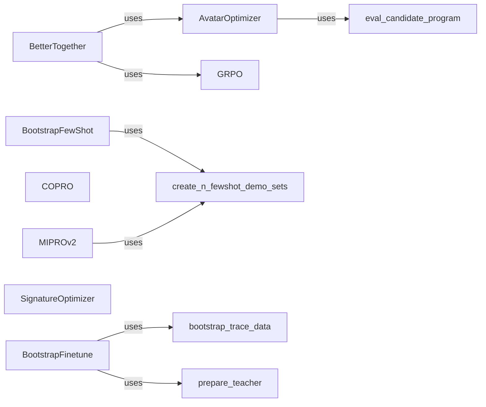

## Component Details

The Prompt Optimization and Teleprompting component in DSPy focuses on automating the process of prompt engineering for language models. It encompasses various strategies to discover effective prompts and demonstrations, thereby improving the performance of programs that utilize LMs. The core idea is to optimize the input to the LM, which includes not only the prompt itself but also few-shot examples, to achieve better accuracy and robustness. This involves techniques like generating positive and negative examples, using gradient-based optimization, and employing meta-instruction prompt optimization.

### BootstrapFewShot
This component is a teleprompter that uses a bootstrap method to generate few-shot examples for prompting. It automatically creates demonstrations to improve the performance of language models on specific tasks. It leverages the `create_n_fewshot_demo_sets` utility to generate these demonstrations.
- **Related Classes/Methods**: `dspy.teleprompt.bootstrap.BootstrapFewShot`, `dspy.teleprompt.utils.create_n_fewshot_demo_sets`

### MIPROv2
MIPROv2 is a teleprompter that employs a meta-instruction prompt optimization approach to discover optimal prompts. It also uses `create_n_fewshot_demo_sets` to generate demonstrations, similar to BootstrapFewShot, but focuses on optimizing the meta-instructions that guide the LM.
- **Related Classes/Methods**: `dspy.teleprompt.mipro_optimizer_v2.MIPROv2`, `dspy.teleprompt.utils.create_n_fewshot_demo_sets`

### COPRO
COPRO is a teleprompter that uses a contrastive prompt optimization approach to find optimal prompts. It contrasts different prompts to identify the most effective ones for a given task. It optimizes prompts by contrasting positive and negative examples.
- **Related Classes/Methods**: `dspy.teleprompt.copro_optimizer.COPRO`

### AvatarOptimizer
AvatarOptimizer optimizes prompts by generating positive and negative examples and using them to refine the prompt. It leverages an evaluation function to assess the quality of generated prompts and examples.
- **Related Classes/Methods**: `dspy.teleprompt.avatar_optimizer.AvatarOptimizer`, `dspy.teleprompt.utils.eval_candidate_program`

### GRPO
GRPO is a gradient-based prompt optimization technique that uses validation metrics to guide the prompt refinement process. It refines prompts based on gradient descent, using validation metrics to guide the optimization.
- **Related Classes/Methods**: `dspy.teleprompt.grpo.GRPO`

### BetterTogether
BetterTogether combines multiple prompt optimization strategies to achieve better performance than any single strategy alone. It integrates AvatarOptimizer and GRPO to leverage their complementary strengths.
- **Related Classes/Methods**: `dspy.teleprompt.bettertogether.BetterTogether`

### SignatureOptimizer
SignatureOptimizer optimizes the signature of a program to improve its performance. It focuses on refining the input and output specifications of a program to enhance its interaction with language models.
- **Related Classes/Methods**: `dspy.teleprompt.signature_opt.SignatureOptimizer`

### BootstrapFinetune
BootstrapFinetune is a teleprompter that uses a bootstrap method to generate training data and then finetunes a language model on that data. It leverages `bootstrap_trace_data` to generate training data and `prepare_teacher` to prepare the teacher model for finetuning.
- **Related Classes/Methods**: `dspy.teleprompt.bootstrap_finetune.BootstrapFinetune`
