```mermaid
graph LR
    LM_Interaction_Management["LM Interaction Management"]
    Module_Composition_and_Execution["Module Composition and Execution"]
    Prompt_Optimization_and_Teleprompting["Prompt Optimization and Teleprompting"]
    Knowledge_Integration["Knowledge Integration"]
    Evaluation_and_Performance_Monitoring["Evaluation and Performance Monitoring"]
    Data_Management["Data Management"]
    Prediction_Strategies["Prediction Strategies"]
    LM_Interaction_Management -- "defines interface for" --> Prediction_Strategies
    Prediction_Strategies -- "uses" --> LM_Interaction_Management
    Module_Composition_and_Execution -- "encapsulates" --> Prediction_Strategies
    Module_Composition_and_Execution -- "uses" --> LM_Interaction_Management
    Prompt_Optimization_and_Teleprompting -- "integrates" --> Module_Composition_and_Execution
    Prompt_Optimization_and_Teleprompting -- "optimizes" --> LM_Interaction_Management
    Evaluation_and_Performance_Monitoring -- "evaluates" --> Module_Composition_and_Execution
    Knowledge_Integration -- "retrieves" --> Module_Composition_and_Execution
    Data_Management -- "uses" --> Prompt_Optimization_and_Teleprompting
    Data_Management -- "uses" --> Evaluation_and_Performance_Monitoring
    click LM_Interaction_Management href "https://github.com/CodeBoarding/GeneratedOnBoardings/blob/main/dspy/LM Interaction Management.md" "Details"
    click Module_Composition_and_Execution href "https://github.com/CodeBoarding/GeneratedOnBoardings/blob/main/dspy/Module Composition and Execution.md" "Details"
    click Prompt_Optimization_and_Teleprompting href "https://github.com/CodeBoarding/GeneratedOnBoardings/blob/main/dspy/Prompt Optimization and Teleprompting.md" "Details"
    click Knowledge_Integration href "https://github.com/CodeBoarding/GeneratedOnBoardings/blob/main/dspy/Knowledge Integration.md" "Details"
    click Evaluation_and_Performance_Monitoring href "https://github.com/CodeBoarding/GeneratedOnBoardings/blob/main/dspy/Evaluation and Performance Monitoring.md" "Details"
    click Data_Management href "https://github.com/CodeBoarding/GeneratedOnBoardings/blob/main/dspy/Data Management.md" "Details"
    click Prediction_Strategies href "https://github.com/CodeBoarding/GeneratedOnBoardings/blob/main/dspy/Prediction Strategies.md" "Details"
```

## Component Details

DSPy is a framework for programming with language models (LMs) to solve advanced tasks. It provides a high-level interface for composing LMs, managing prompts, and optimizing performance. The core flow involves defining signatures for LM calls, using modules to encapsulate LM interactions, and employing teleprompters to automatically optimize prompts and few-shot examples. DSPy also includes tools for retrieval, evaluation, and data handling, enabling developers to build and deploy robust LM-powered applications.

### LM Interaction Management
This component manages all interactions with Language Models. It includes defining signatures for LM calls, handling API requests, caching responses, and adapting input/output formats. It abstracts away the complexities of different LM providers and ensures consistent and reliable LM behavior.
- **Related Classes/Methods**: `dspy.signatures.signature`, `dspy.signatures.field`, `dspy.clients.lm`, `dspy.clients.base_lm`, `dspy.clients.openai`, `dspy.clients.cache`, `dspy.adapters.base`, `dspy.adapters.chat_adapter`, `dspy.adapters.json_adapter`

### Module Composition and Execution
This component provides the base class `BaseModule` and `Module` for creating reusable components that encapsulate LM calls and other operations. Modules can be composed to build complex data processing pipelines. They manage parameters, state, and LM configurations, enabling modular and scalable program design.
- **Related Classes/Methods**: `dspy.primitives.module`, `dspy.primitives.program`

### Prompt Optimization and Teleprompting
This component includes classes for optimizing prompts and few-shot examples for LMs. It offers various teleprompting strategies like `BootstrapFewShot`, `MIPRO`, and `COPRO`, which automatically discover effective prompts and demonstrations. It improves program performance by optimizing LM inputs.
- **Related Classes/Methods**: `dspy.teleprompt.bootstrap`, `dspy.teleprompt.mipro_optimizer_v2`, `dspy.teleprompt.copro_optimizer`

### Knowledge Integration
This component provides modules for retrieving relevant information from external sources. It includes a base `Retrieve` class and implementations for different retrieval methods, such as vector databases and search engines. It enhances program capabilities by integrating external knowledge.
- **Related Classes/Methods**: `dspy.retrieve.retrieve`, `dspy.retrieve.chromadb_rm`, `dspy.retrieve.pinecone_rm`

### Evaluation and Performance Monitoring
This component provides tools for evaluating the performance of DSPy programs. It includes classes for defining metrics and running evaluations on datasets. It also offers automatic evaluation methods using LMs. It ensures program quality and provides insights for improvement.
- **Related Classes/Methods**: `dspy.evaluate.evaluate`, `dspy.evaluate.metrics`, `dspy.evaluate.auto_evaluation`

### Data Management
This component provides tools for loading and managing datasets. It includes classes for loading data from various formats, such as CSV, JSON, and Hugging Face datasets. It also offers utilities for splitting and sampling datasets. It supports the data needs for training and evaluating DSPy programs.
- **Related Classes/Methods**: `dspy.datasets.dataset`, `dspy.datasets.dataloader`

### Prediction Strategies
This component includes modules that use LMs to make predictions based on defined signatures. It offers various prediction strategies like `Predict`, `ChainOfThought`, and `ReAct`, each implementing a different prompting and reasoning approach. It is responsible for generating predictions from LMs based on program logic.
- **Related Classes/Methods**: `dspy.predict.predict`, `dspy.predict.chain_of_thought`, `dspy.predict.react`