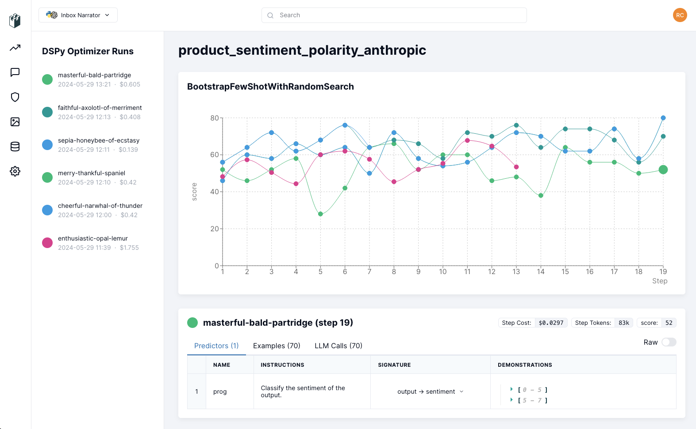

<p align="center">
  
</p>
<p align="left">


## DSPy: _Programming_—not prompting—Foundation Models

**[Jun'24] [Optimizing Instructions and Demonstrations for Multi-Stage Language Model Programs](https://arxiv.org/abs/2406.11695)**       
**[Oct'23] [DSPy: Compiling Declarative Language Model Calls into Self-Improving Pipelines](https://arxiv.org/abs/2310.03714)**     
[Jul'24] [Fine-Tuning and Prompt Optimization: Two Great Steps that Work Better Together](https://arxiv.org/abs/2407.10930)     
[Jun'24] [Prompts as Auto-Optimized Training Hyperparameters](https://arxiv.org/abs/2406.11706)    
[Feb'24] [Assisting in Writing Wikipedia-like Articles From Scratch with Large Language Models](https://arxiv.org/abs/2402.14207)         
[Jan'24] [In-Context Learning for Extreme Multi-Label Classification](https://arxiv.org/abs/2401.12178)       
[Dec'23] [DSPy Assertions: Computational Constraints for Self-Refining Language Model Pipelines](https://arxiv.org/abs/2312.13382)   
[Dec'22] [Demonstrate-Search-Predict: Composing Retrieval & Language Models for Knowledge-Intensive NLP](https://arxiv.org/abs/2212.14024.pdf)


**Getting Started:** &nbsp; [](https://colab.research.google.com/github/stanfordnlp/dspy/blob/main/intro.ipynb)

**Documentation:** [DSPy Docs](https://dspy-docs.vercel.app/)

**Improvements in & Migration to DSPy 2.5:** [Migration to DSPy 2.5](https://github.com/stanfordnlp/dspy/blob/main/examples/migration.ipynb)

**Roadmap for DSPy 2.5 & 3.0:** [Roadmap Sketch](https://github.com/stanfordnlp/dspy/blob/main/docs/docs/roadmap.md)

**How is DSPy Used?:** [DSPy Use Cases](docs/docs/dspy-usecases.md)

[](https://pepy.tech/project/dspy-ai)  [](https://pepy.tech/project/dspy-ai)

----

**DSPy is a framework for algorithmically optimizing LM prompts and weights**, especially when LMs are used one or more times within a pipeline. To use LMs to build a complex system _without_ DSPy, you generally have to: (1) break the problem down into steps, (2) prompt your LM well until each step works well in isolation, (3) tweak the steps to work well together, (4) generate synthetic examples to tune each step, and (5) use these examples to finetune smaller LMs to cut costs. Currently, this is hard and messy: every time you change your pipeline, your LM, or your data, all prompts (or finetuning steps) may need to change.

To make this more systematic and much more powerful, **DSPy** does two things. First, it separates the flow of your program (`modules`) from the parameters (LM prompts and weights) of each step. Second, **DSPy** introduces new `optimizers`, which are LM-driven algorithms that can tune the prompts and/or the weights of your LM calls, given a `metric` you want to maximize.

**DSPy** can routinely teach powerful models like `GPT-3.5` or `GPT-4` and local models like `T5-base` or `Llama2-13b` to be much more reliable at tasks, i.e. having higher quality and/or avoiding specific failure patterns. **DSPy** optimizers will "compile" the _same_ program into _different_ instructions, few-shot prompts, and/or weight updates (finetunes) for each LM. This is a new paradigm in which LMs and their prompts fade into the background as optimizable pieces of a larger system that can learn from data. **tldr;** less prompting, higher scores, and a more systematic approach to solving hard tasks with LMs.

### Table of Contents

If you need help thinking about your task, we recently created a [Discord server](https://discord.gg/XCGy2WDCQB) for the community.

1. **[Installation](#1-installation)**
1. **[Tutorials & Documentation](#2-documentation)**
1. **[Framework Syntax](#3-syntax-youre-in-charge-of-the-workflowits-free-form-python-code)**
1. **[Compiling: Two Powerful Concepts](#4-two-powerful-concepts-signatures--teleprompters)**
1. **[Pydantic Types](#5-pydantic-types)** 
1. **[FAQ: Is DSPy right for me?](#6-faq-is-dspy-right-for-me)**

### Analogy to Neural Networks

When we build neural networks, we don't write manual _for-loops_ over lists of _hand-tuned_ floats. Instead, you might use a framework like [PyTorch](https://pytorch.org/) to compose declarative layers (e.g., `Convolution` or `Dropout`) and then use optimizers (e.g., SGD or Adam) to learn the parameters of the network.

Ditto! **DSPy** gives you the right general-purpose modules (e.g., `ChainOfThought`, `ReAct`, etc.), which replace string-based prompting tricks. To replace prompt hacking and one-off synthetic data generators, **DSPy** also gives you general optimizers (`BootstrapFewShotWithRandomSearch` or [`BayesianSignatureOptimizer`](https://github.com/stanfordnlp/dspy/blob/main/dspy/teleprompt/signature_opt_bayesian.py)), which are algorithms that update parameters in your program. Whenever you modify your code, your data, your assertions, or your metric, you can _compile_ your program again and **DSPy** will create new effective prompts that fit your changes.

### Mini-FAQs

**What do DSPy optimizers tune?** Each optimizer is different, but they all seek to maximize a metric on your program by updating prompts or LM weights. Current DSPy `optimizers` can inspect your data, simulate traces through your program to generate good/bad examples of each step, propose or refine instructions for each step based on past results, finetune the weights of your LM on self-generated examples, or combine several of these to improve quality or cut cost. We'd love to merge new optimizers that explore a richer space: most manual steps you currently go through for prompt engineering, "synthetic data" generation, or self-improvement can probably generalized into a DSPy optimizer that acts on arbitrary LM programs.

**How should I use DSPy for my task?** Using DSPy is an iterative process. You first define your task and the metrics you want to maximize, and prepare a few example inputs — typically without labels (or only with labels for the final outputs, if your metric requires them). Then, you build your pipeline by selecting built-in layers (`modules`) to use, giving each layer a `signature` (input/output spec), and then calling your modules freely in your Python code. Lastly, you use a DSPy `optimizer` to compile your code into high-quality instructions, automatic few-shot examples, or updated LM weights for your LM.

**What if I have a better idea for prompting or synthetic data generation?** Perfect. We encourage you to think if it's best expressed as a module or an optimizer, and we'd love to merge it in DSPy so everyone can use it. DSPy is not a complete project; it's an ongoing effort to create structure (modules and optimizers) in place of hacky prompt and pipeline engineering tricks.

**What does DSPy stand for?** It's a long story but the backronym now is **D**eclarative **S**elf-improving Language **P**rograms, p**y**thonically.

## 1) Installation

All you need is:

```bash
pip install dspy-ai
```

To install the very latest from `main`:

```bash
pip install git+https://github.com/stanfordnlp/dspy.git
````

Or open our intro notebook in Google Colab: [](https://colab.research.google.com/github/stanfordnlp/dspy/blob/main/intro.ipynb)

By default, DSPy installs the latest `openai` from pip. However, if you install old version before OpenAI changed their API `openai~=0.28.1`, the library will use that just fine. Both are supported.

For the optional (alphabetically sorted) [Chromadb](https://github.com/chroma-core/chroma), [LanceDB](https://github.com/lancedb/lancedb), [Groq](https://github.com/groq/groq-python), [Marqo](https://github.com/marqo-ai/marqo), [Milvus](https://github.com/milvus-io/milvus), [MongoDB](https://www.mongodb.com), [MyScaleDB](https://github.com/myscale/myscaledb), Pinecone, [Qdrant](https://github.com/qdrant/qdrant), [Snowflake](https://github.com/snowflakedb/snowpark-python), or [Weaviate](https://github.com/weaviate/weaviate) retrieval integration(s), include the extra(s) below:

```
pip install dspy-ai[chromadb] # or [lancedb] or [groq] or [marqo] or [milvus] or [mongodb] or [myscale] or [pinecone] or [qdrant] or [snowflake] or [weaviate]
```

## 2) Documentation

The DSPy documentation is divided into **tutorials** (step-by-step illustration of solving a task in DSPy), **guides** (how to use specific parts of the API), and **examples** (self-contained programs that illustrate usage).

### A) Tutorials

| **Level** |  **Tutorial** |  **Run in Colab** |  **Description** |
| --- | -------------  |  -------------  |  -------------  | 
| Beginner |  [**Getting Started**](intro.ipynb) | [](https://colab.research.google.com/github/stanfordnlp/dspy/blob/main/intro.ipynb)  |  Introduces the basic building blocks in DSPy. Tackles the task of complex question answering with HotPotQA. |
| Beginner | [**Minimal Working Example**](https://dspy-docs.vercel.app/docs/quick-start/minimal-example) | N/A | Builds and optimizes a very simple chain-of-thought program in DSPy for math question answering. Very short. |
| Beginner | [**Compiling for Tricky Tasks**](examples/nli/scone/scone.ipynb) | N/A | Teaches LMs to reason about logical statements and negation. Uses GPT-4 to bootstrap few-shot CoT demonstations for GPT-3.5. Establishes a state-of-the-art result on [ScoNe](https://arxiv.org/abs/2305.19426). Contributed by [Chris Potts](https://twitter.com/ChrisGPotts/status/1740033519446057077). |
| Beginner | [**Local Models & Custom Datasets**](examples/skycamp2023.ipynb) | [](https://colab.research.google.com/github/stanfordnlp/dspy/blob/main/examples/skycamp2023.ipynb) | Illustrates two different things together: how to use local models (Llama-2-13B in particular) and how to use your own data examples for training and development.
| Intermediate | [**The DSPy Paper**](https://arxiv.org/abs/2310.03714) | N/A | Sections 3, 5, 6, and 7 of the DSPy paper can be consumed as a tutorial. They include explained code snippets, results, and discussions of the abstractions and API.
| Intermediate | [**DSPy Assertions**](https://arxiv.org/abs/2312.13382) | [](https://colab.research.google.com/github/stanfordnlp/dspy/blob/main/examples/longformqa/longformqa_assertions.ipynb) | Introduces example of applying DSPy Assertions while generating long-form responses to questions with citations. Presents comparative evaluation in both zero-shot and compiled settings.
| Intermediate | [**Finetuning for Complex Programs**](https://twitter.com/lateinteraction/status/1712135660797317577) | [](https://colab.research.google.com/github/stanfordnlp/dspy/blob/main/examples/qa/hotpot/multihop_finetune.ipynb) | Teaches a local T5 model (770M) to do exceptionally well on HotPotQA. Uses only 200 labeled answers. Uses no hand-written prompts, no calls to OpenAI, and no labels for retrieval or reasoning.
| Advanced | [**Information Extraction**](https://twitter.com/KarelDoostrlnck/status/1724991014207930696) | [](https://colab.research.google.com/drive/1CpsOiLiLYKeGrhmq579_FmtGsD5uZ3Qe) | Tackles extracting information from long articles (biomedical research papers). Combines in-context learning and retrieval to set SOTA on BioDEX. Contributed by [Karel D’Oosterlinck](https://twitter.com/KarelDoostrlnck/status/1724991014207930696).  |


**Other resources people find useful**:

- [DSPy talk at ScaleByTheBay Nov 2023](https://www.youtube.com/watch?v=Dt3H2ninoeY).
- [DSPy webinar with MLOps Learners](https://www.youtube.com/watch?v=im7bCLW2aM4), a bit longer with Q&A.
- Hands-on Overviews of DSPy by the community: [DSPy Explained! by Connor Shorten](https://www.youtube.com/watch?v=41EfOY0Ldkc), [DSPy explained by code_your_own_ai](https://www.youtube.com/watch?v=ycfnKPxBMck), [DSPy Crash Course by AI Bites](https://youtu.be/5-zgASQKkKQ?si=3gnmVouT5_rpk_nu), [DSPy Paper Explained by Unify](https://youtu.be/kFB8kFchCH4?si=FuM6L5H5lweanckz)
- Interviews: [Weaviate Podcast in-person](https://www.youtube.com/watch?v=CDung1LnLbY), and you can find 6-7 other remote podcasts on YouTube from a few different perspectives/audiences.
- **Tracing in DSPy** with Arize Phoenix: [Tutorial for tracing your prompts and the steps of your DSPy programs](https://colab.research.google.com/github/Arize-ai/phoenix/blob/main/tutorials/tracing/dspy_tracing_tutorial.ipynb)
- **Tracing & Experimentation in DSPy** with Langtrace: [Run experiments, capture traces, metrics, checkpoints and visualize eval scores with Langtrace](https://docs.langtrace.ai/supported-integrations/llm-frameworks/dspy#dspy)
- [DSPy: Not Your Average Prompt Engineering](https://jina.ai/news/dspy-not-your-average-prompt-engineering), why it's crucial for future prompt engineering, and yet why it is challenging for prompt engineers to learn.
- **Tracing & Optimization Tracking in DSPy** with Parea AI: [Tutorial on tracing & evaluating a DSPy RAG program](https://docs.parea.ai/tutorials/dspy-rag-trace-evaluate/tutorial)
- [DSPy: Not Your Average Prompt Engineering](https://jina.ai/news/dspy-not-your-average-prompt-engineering), why it's crucial for future prompt engineering, and yet why it is challenging for prompt engineers to learn.

### B) Guides

If you're new to DSPy, it's probably best to go in sequential order. You will probably refer to these guides frequently after that, e.g. to copy/paste snippets that you can edit for your own DSPy programs.


1. **[Language Models](https://dspy-docs.vercel.app/docs/building-blocks/language_models)**

2. **[Signatures](https://dspy-docs.vercel.app/docs/building-blocks/signatures)**

3. **[Modules](https://dspy-docs.vercel.app/docs/building-blocks/modules)**

5. **[Data](https://dspy-docs.vercel.app/docs/building-blocks/data)**

5. **[Metrics](https://dspy-docs.vercel.app/docs/building-blocks/metrics)**

4. **[Optimizers (formerly Teleprompters)](https://dspy-docs.vercel.app/docs/building-blocks/optimizers)**

6. **[DSPy Assertions](https://dspy-docs.vercel.app/docs/building-blocks/assertions)**


### C) Examples

The DSPy team believes complexity has to be justified. We take this seriously: we never release a complex tutorial (above) or example (below) _unless we can demonstrate empirically that this complexity has generally led to improved quality or cost._ This kind of rule is rarely enforced by other frameworks or docs, but you can count on it in DSPy examples.

There's a bunch of examples in the `examples/` directory and in the top-level directory. We welcome contributions!

You can find other examples tweeted by [@lateinteraction](https://twitter.com/lateinteraction) on Twitter/X.

**Some other examples (not exhaustive, feel free to add more via PR):**


- [DSPy Optimizers Benchmark on a bunch of different tasks, by Michael Ryan](https://github.com/stanfordnlp/dspy/tree/main/testing/tasks)
- [Sophisticated Extreme Multi-Class Classification, IReRa, by Karel D’Oosterlinck](https://github.com/KarelDO/xmc.dspy)
- [Haize Lab's Red Teaming with DSPy](https://blog.haizelabs.com/posts/dspy/) and see [their DSPy code](https://github.com/haizelabs/dspy-redteam)
- Applying DSPy Assertions
  - [Long-form Answer Generation with Citations, by Arnav Singhvi](https://colab.research.google.com/github/stanfordnlp/dspy/blob/main/examples/longformqa/longformqa_assertions.ipynb)
  - [Generating Answer Choices for Quiz Questions, by Arnav Singhvi](https://colab.research.google.com/github/stanfordnlp/dspy/blob/main/examples/quiz/quiz_assertions.ipynb)
  - [Generating Tweets for QA, by Arnav Singhvi](https://colab.research.google.com/github/stanfordnlp/dspy/blob/main/examples/tweets/tweets_assertions.ipynb)
- [Compiling LCEL runnables from LangChain in DSPy](https://github.com/stanfordnlp/dspy/blob/main/examples/tweets/compiling_langchain.ipynb)
- [AI feedback, or writing LM-based metrics in DSPy](https://github.com/stanfordnlp/dspy/blob/main/examples/tweets/tweet_metric.py)
- [DSPy Optimizers Benchmark on a bunch of different tasks, by Michael Ryan](https://github.com/stanfordnlp/dspy/tree/main/testing/README.md)
- [Indian Languages NLI with gains due to compiling by Saiful Haq](https://github.com/saifulhaq95/DSPy-Indic/blob/main/indicxlni.ipynb)
- [DSPy on BIG-Bench Hard Example, by Chris Levy](https://drchrislevy.github.io/posts/dspy/dspy.html)
- [Using Ollama with DSPy for Mistral (quantized) by @jrknox1977](https://gist.github.com/jrknox1977/78c17e492b5a75ee5bbaf9673aee4641)
- [Using DSPy, "The Unreasonable Effectiveness of Eccentric Automatic Prompts" (paper) by VMware's Rick Battle & Teja Gollapudi](https://arxiv.org/abs/2402.10949), and [interview at TheRegister](https://www.theregister.com/2024/02/22/prompt_engineering_ai_models/)
- [Optimizing Performance of Open Source LM for Text-to-SQL using DSPy and vLLM, by Juan Ovalle](https://github.com/jjovalle99/DSPy-Text2SQL)
- Typed DSPy (contributed by [@normal-computing](https://github.com/normal-computing))
  - [Using DSPy to train Gpt 3.5 on HumanEval by Thomas Ahle](https://github.com/stanfordnlp/dspy/blob/main/examples/functional/functional.ipynb)
  - [Building a chess playing agent using DSPy by Franck SN](https://medium.com/thoughts-on-machine-learning/building-a-chess-playing-agent-using-dspy-9b87c868f71e)
- [Building LLMs for Code Repair](https://blog.replit.com/code-repair) 

TODO: Add links to the state-of-the-art results by the University of Toronto on Clinical NLP and on Theory of Mind (ToM) by Plastic Labs.

There are also recent cool examples at [Weaviate's DSPy cookbook](https://github.com/weaviate/recipes/tree/main/integrations/llm-frameworks/dspy) by Connor Shorten. [See tutorial on YouTube](https://www.youtube.com/watch?v=CEuUG4Umfxs).


### D) Visualization

For visualizing the progress during the optimization process, LangWatch has a [DSPy Visualizer](https://docs.langwatch.ai/dspy-visualization/quickstart) to help understanding and debugging the optimizer by inspecting the prompts, signature and demonstrations being optimized, the examples being evaluated, as well as the LM calls and costs:



## 3) Syntax: You're in charge of the workflow—it's free-form Python code!

**DSPy** hides tedious prompt engineering, but it cleanly exposes the important decisions you need to make: **[1]** what's your system design going to look like? **[2]** what are the important constraints on the behavior of your program?

You express your system as free-form Pythonic modules. **DSPy** will tune the quality of your program _in whatever way_ you use foundation models: you can code with loops, `if` statements, or exceptions, and use **DSPy** modules within any Python control flow you think works for your task.

Suppose you want to build a simple retrieval-augmented generation (RAG) system for question answering. You can define your own `RAG` program like this:

```python
class RAG(dspy.Module):
    def __init__(self, num_passages=3):
        super().__init__()
        self.retrieve = dspy.Retrieve(k=num_passages)
        self.generate_answer = dspy.ChainOfThought("context, question -> answer")
    
    def forward(self, question):
        context = self.retrieve(question).passages
        answer = self.generate_answer(context=context, question=question)
        return answer
```

A program has two key methods, which you can edit to fit your needs.

**Your `__init__` method** declares the modules you will use. Here, `RAG` will use the built-in `Retrieve` for retrieval and `ChainOfThought` for generating answers. **DSPy** offers general-purpose modules that take the shape of _your own_ sub-tasks — and not pre-built functions for specific applications.

Modules that use the LM, like `ChainOfThought`, require a _signature_. That is a declarative spec that tells the module what it's expected to do. In this example, we use the short-hand signature notation `context, question -> answer` to tell `ChainOfThought` it will be given some `context` and a `question` and must produce an `answer`. We will discuss more advanced **[signatures](#3a-declaring-the-inputoutput-behavior-of-lms-with-dspysignature)** below.


**Your `forward` method** expresses any computation you want to do with your modules. In this case, we use the module `self.retrieve` to search for some `context` and then use the module `self.generate_answer`, which uses the `context` and `question` to generate the `answer`!

You can now either use this `RAG` program in **zero-shot mode**. Or **compile** it to obtain higher quality. Zero-shot usage is simple. Just define an instance of your program and then call it:

```python
rag = RAG()  # zero-shot, uncompiled version of RAG
rag("what is the capital of France?").answer  # -> "Paris"
```

The next section will discuss how to compile our simple `RAG` program. When we compile it, the **DSPy compiler** will annotate _demonstrations_ of its steps: (1) retrieval, (2) using context, and (3) using _chain-of-thought_ to answer questions. From these demonstrations, the **DSPy compiler** will make sure it produces an effective few-shot prompt that works well with your LM, retrieval model, and data. If you're working with small models, it'll finetune your model (instead of prompting) to do this task.

If you later decide you need another step in your pipeline, just add another module and compile again. Maybe add a module that takes the chat history into account during search?


## 4) Two Powerful Concepts: Signatures & Teleprompters

**Note:** We will soon rename teleprompters to optimizers. This will not affect their functionality, but will simplify the terms used.

To make it possible to compile any program you write, **DSPy** introduces two simple concepts: Signatures and Teleprompters.


#### 4.a) Declaring the input/output behavior of LMs with `dspy.Signature`

When we assign tasks to LMs in **DSPy**, we specify the behavior we need as a **Signature**. A signature is a declarative specification of input/output behavior of a **DSPy module**.

Instead of investing effort into _how_ to get your LM to do a sub-task, signatures enable you to inform **DSPy** _what_ the sub-task is. Later, the **DSPy compiler** will figure out how to build a complex prompt for your large LM (or finetune your small LM) specifically for your signature, on your data, and within your pipeline.

A signature consists of three simple elements:

- A minimal description of the sub-task the LM is supposed to solve.
- A description of one or more input fields (e.g., input question) that will we will give to the LM.
- A description of one or more output fields (e.g., the question's answer) that we will expect from the LM.


We support two notations for expressing signatures. The **short-hand signature notation** is for quick development. You just provide your module (e.g., `dspy.ChainOfThought`) with a string with `input_field_name_1, ... -> output_field_name_1, ...` with the fields separated by commas.

In the `RAG` class earlier, we saw:

```python
self.generate_answer = dspy.ChainOfThought("context, question -> answer")
```

In many cases, this barebones signature is sufficient. However, sometimes you need more control. In these cases, we can use the full notation to express a more fully-fledged signature below.

```python
class GenerateSearchQuery(dspy.Signature):
    """Write a simple search query that will help answer a complex question."""

    context = dspy.InputField(desc="may contain relevant facts")
    question = dspy.InputField()
    query = dspy.OutputField()

### inside your program's __init__ function
self.generate_answer = dspy.ChainOfThought(GenerateSearchQuery)
```

You can optionally provide a `prefix` and/or `desc` key for each input or output field to refine or constrain the behavior of modules using your signature. The description of the sub-task itself is specified as the docstring (i.e., `"""Write a simple..."""`).


#### 4.b) Asking **DSPy** to automatically optimize your program with `dspy.teleprompt.*`

After defining the `RAG` program, we can **compile** it. Compiling a program will update the parameters stored in each module. For large LMs, this is primarily in the form of creating and validating good demonstrations for inclusion in your prompt(s).

Compiling depends on three things: a (potentially tiny) training set, a metric for validation, and your choice of teleprompter from **DSPy**. **Teleprompters** are powerful optimizers (included in **DSPy**) that can learn to bootstrap and select effective prompts for the modules of any program. (The  "tele-" in the name means "at a distance", i.e., automatic prompting at a distance.)

**DSPy** typically requires very minimal labeling. For example, our `RAG` pipeline may work well with just a handful of examples that contain a **question** and its (human-annotated) **answer**. Your pipeline may involve multiple complex steps: our basic `RAG` example includes a retrieved context, a chain of thought, and the answer. However, you only need labels for the initial question and the final answer. **DSPy** will bootstrap any intermediate labels needed to support your pipeline. If you change your pipeline in any way, the data bootstrapped will change accordingly!


```python
my_rag_trainset = [
  dspy.Example(
    question="Which award did Gary Zukav's first book receive?",
    answer="National Book Award"
  ),
  ...
]
```

Second, define your validation logic, which will express some constraints on the behavior of your program or individual modules. For `RAG`, we might express a simple check like this:

```python
def validate_context_and_answer(example, pred, trace=None):
    # check the gold label and the predicted answer are the same
    answer_match = example.answer.lower() == pred.answer.lower()

    # check the predicted answer comes from one of the retrieved contexts
    context_match = any((pred.answer.lower() in c) for c in pred.context)

    return answer_match and context_match
```


Different teleprompters offer various tradeoffs in terms of how much they optimize cost versus quality, etc. For `RAG`, we might use the simple teleprompter called `BootstrapFewShot`. To do so, we instantiate the teleprompter itself with a validation function `my_rag_validation_logic` and then compile against some training set `my_rag_trainset`.

```python
from dspy.teleprompt import BootstrapFewShot

teleprompter = BootstrapFewShot(metric=my_rag_validation_logic)
compiled_rag = teleprompter.compile(RAG(), trainset=my_rag_trainset)
```

If we now use `compiled_rag`, it will invoke our LM with rich prompts with few-shot demonstrations of chain-of-thought retrieval-augmented question answering on our data.


## 5) Pydantic Types

Sometimes you need more than just string inputs/outputs.
Assume, for example, you need to find 

```python
from pydantic import BaseModel, Field
from dspy.functional import TypedPredictor

class TravelInformation(BaseModel):
    origin: str = Field(pattern=r"^[A-Z]{3}$")
    destination: str = Field(pattern=r"^[A-Z]{3}$")
    date: datetime.date
    confidence: float = Field(gt=0, lt=1)

class TravelSignature(Signature):
    """ Extract all travel information in the given email """
    email: str = InputField()
    flight_information: list[TravelInformation] = OutputField()

predictor = TypedPredictor(TravelSignature)
predictor(email='...')
```

Which will output a list of `TravelInformation` objects.

There are other ways to create typed signatures too. Such as
```python
predictor = TypedChainOfThought("question:str -> answer:int")
```
which applies chain of thought, and is guaranteed to return an int.

There's even an approach inspired by [tanuki.py](https://github.com/Tanuki/tanuki.py), which can be convenient when defining modules:
```python
from dspy.functional import FunctionalModule, predictor, cot

class MyModule(FunctionalModule):
    @predictor
    def hard_question(possible_topics: list[str]) -> str:
        """Write a hard question based on one of the topics. It should be answerable by a number."""

    @cot
    def answer(question: str) -> float:
        pass

    def forward(possible_topics: list[str]):
        q = hard_question(possible_topics=possible_topics)
        a = answer(question=q)
        return (q, a)
```

For more examples, see [the list above](https://github.com/stanfordnlp/dspy#:~:text=Typed%20DSPy),
as well as [the unit tests](https://github.com/stanfordnlp/dspy/blob/main/tests/functional/test_functional.py) for the module.

## 6) FAQ: Is DSPy right for me?

The **DSPy** philosophy and abstraction differ significantly from other libraries and frameworks, so it's usually straightforward to decide when **DSPy** is (or isn't) the right framework for your usecase.

If you're a NLP/AI researcher (or a practitioner exploring new pipelines or new tasks), the answer is generally an invariable **yes**. If you're a practitioner doing other things, please read on.


####
<details>
  <summary><h4 style="display: inline">[6.a] DSPy vs. thin wrappers for prompts (OpenAI API, MiniChain, basic templating)</h4></summary>

In other words: _Why can't I just write my prompts directly as string templates?_ Well, for extremely simple settings, this _might_ work just fine. (If you're familiar with neural networks, this is like expressing a tiny two-layer NN as a Python for-loop. It kinda works.)

However, when you need higher quality (or manageable cost), then you need to iteratively explore multi-stage decomposition, improved prompting, data bootstrapping, careful finetuning, retrieval augmentation, and/or using smaller (or cheaper, or local) models. The true expressive power of building with foundation models lies in the interactions between these pieces. But every time you change one piece, you likely break (or weaken) multiple other components.

**DSPy** cleanly abstracts away (_and_ powerfully optimizes) the parts of these interactions that are external to your actual system design. It lets you focus on designing the module-level interactions: the _same program_ expressed in 10 or 20 lines of **DSPy** can easily be compiled into multi-stage instructions for `GPT-4`, detailed prompts for `Llama2-13b`, or finetunes for `T5-base`.

Oh, and you wouldn't need to maintain long, brittle, model-specific strings at the core of your project anymore.

</details>

####
<details>
  <summary><h4 style="display: inline">[6.b] DSPy vs. application development libraries like LangChain, LlamaIndex</h4></summary>


> _Note: If you use LangChain as a thin wrapper around your own prompt strings, refer to answer [5.a] instead._


LangChain and LlamaIndex are popular libraries that target high-level application development with LMs. They offer many _batteries-included_, pre-built application modules that plug in with your data or configuration. In practice, indeed, many usecases genuinely _don't need_ any special components. If you'd be happy to use someone's generic, off-the-shelf prompt for question answering over PDFs or standard text-to-SQL as long as it's easy to set up on your data, then you will probably find a very rich ecosystem in these libraries.

Unlike these libraries, **DSPy** doesn't internally contain hand-crafted prompts that target specific applications you can build. Instead, **DSPy** introduces a very small set of much more powerful and general-purpose modules _that can learn to prompt (or finetune) your LM within your pipeline on your data_.

**DSPy** offers a whole different degree of modularity: when you change your data, make tweaks to your program's control flow, or change your target LM, the **DSPy compiler** can map your program into a new set of prompts (or finetunes) that are optimized specifically for this pipeline. Because of this, you may find that **DSPy** obtains the highest quality for your task, with the least effort, provided you're willing to implement (or extend) your own short program. In short, **DSPy** is for when you need a lightweight but automatically-optimizing programming model — not a library of predefined prompts and integrations.

If you're familiar with neural networks:
> This is like the difference between PyTorch (i.e., representing **DSPy**) and HuggingFace Transformers (i.e., representing the higher-level libraries). If you simply want to use off-the-shelf `BERT-base-uncased` or `GPT2-large` or apply minimal finetuning to them, HF Transformers makes it very straightforward. If, however, you're looking to build your own architecture (or extend an existing one significantly), you have to quickly drop down into something much more modular like PyTorch. Luckily, HF Transformers _is_ implemented in backends like PyTorch. We are similarly excited about high-level wrapper around **DSPy** for common applications. If this is implemented using **DSPy**, your high-level application can also adapt significantly to your data in a way that static prompt chains won't. Please [open an issue](https://github.com/stanfordnlp/dspy/issues/new) if this is something you want to help with.
</details>


####
<details>
  <summary><h4 style="display: inline">[6.c] DSPy vs. generation control libraries like Guidance, LMQL, RELM, Outlines</h4></summary>


Guidance, LMQL, RELM, and Outlines are all exciting new libraries for controlling the individual completions of LMs, e.g., if you want to enforce JSON output schema or constrain sampling to a particular regular expression.

This is very useful in many settings, but it's generally focused on low-level, structured control of a single LM call. It doesn't help ensure the JSON (or structured output) you get is going to be correct or useful for your task.

In contrast, **DSPy** automatically optimizes the prompts in your programs to align them with various task needs, which may also include producing valid structured ouputs. That said, we are considering allowing **Signatures** in **DSPy** to express regex-like constraints that are implemented by these libraries.
</details>

## Testing

To run the tests, you need to first clone the repository.

Then install the package through poetry:
Note - You may need to 

```bash
poetry install --with test
```

Then run the all tests, or a specific test suite, with the following commands:

```bash
poetry run pytest
poetry run pytest tests/PATH_TO_TEST_SUITE
```

## Contribution Quickstart

See [CONTRIBUTING.md](CONTRIBUTING.md) for a quickstart guide to contributing to DSPy.

## Team, Contributors, & Acknowledgements

Project Lead: **Omar Khattab**  

Project Mentors: **Chris Potts**, **Matei Zaharia**, **Heather Miller**  

Core Library: **Arnav Singhvi**, **Herumb Shandilya**, **Sri Vardhamanan**,  **Cyrus Nouroozi**, **Amir Mehr**, **Kyle Caverly**, with special thanks to **Keshav Santhanam**, **Thomas Ahle**, **Connor Shorten**

Prompt Optimization: **Krista Opsahl-Ong**, **Michael Ryan**, **Josh Purtell**, with special thanks to **Karel D'Oosterlinck**, **Eric Zhang**

Finetuning & RL: **Dilara Soylu**, **Isaac Miller**, **Souradip Chakraborty**

PL Abstractions: **Shangyin Tan**, **Manish Shetty**, **Peter Zhong**  

Applications: **Jasper Xian**, **Saron Samuel**, **Alberto Mancarella**, **Faraz Khoubsirat**, **Saiful Haq**, **Ashutosh Sharma**  

Special thanks to **Rick Battle**, **Dhar Rawal**, **Insop Song**, **Tom Dorr**, **Igor Kotenkov**, **Corey Zumar**, **Lisa Li**, **David Hall**, **Ashwin Paranjape**, **Chris Manning**, **Avi Sil**.

The **DSPy** logo is designed by **Chuyi Zhang**.


## 📜 Citation & Reading More

To stay up to date or learn more, follow [@lateinteraction](https://twitter.com/lateinteraction) on Twitter.

If you use DSPy or DSP in a research paper, please cite our work as follows:

```
@article{khattab2023dspy,
  title={DSPy: Compiling Declarative Language Model Calls into Self-Improving Pipelines},
  author={Khattab, Omar and Singhvi, Arnav and Maheshwari, Paridhi and Zhang, Zhiyuan and Santhanam, Keshav and Vardhamanan, Sri and Haq, Saiful and Sharma, Ashutosh and Joshi, Thomas T. and Moazam, Hanna and Miller, Heather and Zaharia, Matei and Potts, Christopher},
  journal={arXiv preprint arXiv:2310.03714},
  year={2023}
}
@article{khattab2022demonstrate,
  title={Demonstrate-Search-Predict: Composing Retrieval and Language Models for Knowledge-Intensive {NLP}},
  author={Khattab, Omar and Santhanam, Keshav and Li, Xiang Lisa and Hall, David and Liang, Percy and Potts, Christopher and Zaharia, Matei},
  journal={arXiv preprint arXiv:2212.14024},
  year={2022}
}
```

You can also read more about the evolution of the framework from Demonstrate-Search-Predict to DSPy:

* [**DSPy Assertions: Computational Constraints for Self-Refining Language Model Pipelines**](https://arxiv.org/abs/2312.13382)   (Academic Paper, Dec 2023) 
* [**DSPy: Compiling Declarative Language Model Calls into Self-Improving Pipelines**](https://arxiv.org/abs/2310.03714) (Academic Paper, Oct 2023) 
* [**Releasing DSPy, the latest iteration of the framework**](https://twitter.com/lateinteraction/status/1694748401374490946) (Twitter Thread, Aug 2023)
* [**Releasing the DSP Compiler (v0.1)**](https://twitter.com/lateinteraction/status/1625231662849073160)  (Twitter Thread, Feb 2023)
* [**Introducing DSP**](https://twitter.com/lateinteraction/status/1617953413576425472)  (Twitter Thread, Jan 2023)
* [**Demonstrate-Search-Predict: Composing retrieval and language models for knowledge-intensive NLP**](https://arxiv.org/abs/2212.14024.pdf) (Academic Paper, Dec 2022)


> _Note: If you're looking for Demonstrate-Search-Predict (DSP), which is the previous version of DSPy, you can find it on the [v1](https://github.com/stanfordnlp/dspy/tree/v1) branch of this repo._


