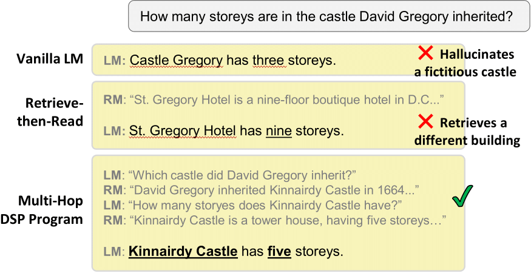
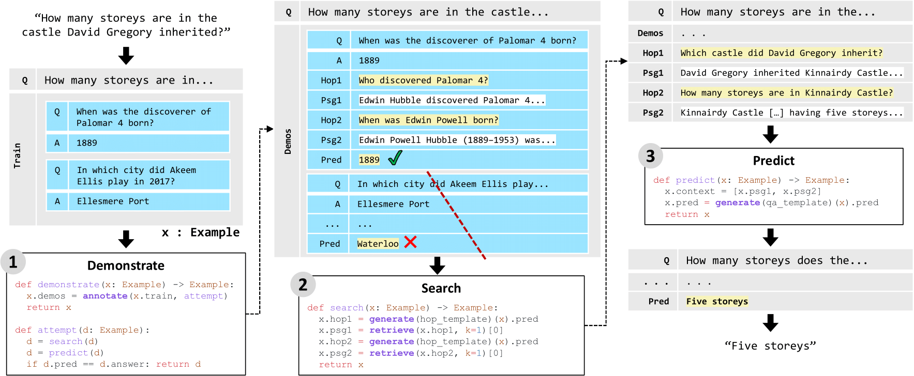

### Note:

The DSP framework will rebrand to **DSPy** soon as we release a completely redesigned **v2** of our framework.

The **DSPy** (i.e., **v2**) release will start today Aug 14th. DSPv1 will remain supported while we transition completely.

<p align="center">
  
</p>
<p align="left">


# 🎓𝗗𝗦𝗣: The Demonstrate–Search–Predict Framework

The **DSP** framework provides a programming abstraction for _rapidly building sophisticated AI systems_. It's primarily (but not exclusively) designed for tasks that are knowledge intensive (e.g., answering user questions or researching complex topics).

You write a **DSP program** in a few lines of code, describing at high level how the problem you'd like to solve should be _decomposed_ into smaller _transformations_. Transformations generate text (by invoking a language model; LM) and/or search for information (by invoking a retrieval model; RM) in high-level steps like `generate a search query to find missing information` or `answer this question using the supplied context`. Our [research paper](https://arxiv.org/abs/2212.14024) shows that building NLP systems with **DSP** can easily outperform GPT-3.5 by up to 120%.

**DSP** programs invoke LMs in a declarative way: you focus on the _what_ (i.e., the algorithmic design of decomposing the problem) and delegate _how_ the transformations are mapped to LM (or RM) calls to the **DSP** runtime. In particular, **DSP** discourages "prompt engineering", which we view much the same way as hyperparameter tuning in traditional ML: a final and minor step that's best done _after_ building up an effective architecture (and which could be delegated to automatic tuning).

To this end, **DSP** offers a number of powerful _primitives_ for building architectures that compose transformations and offers corresponding implementations that map these transformations to effective LM and RM calls. For instance, **DSP** *annotates* few-shot demonstrations for the LM calls within your arbitrary pipeline automatically, and uses them to improve the quality of your transformations. Once you're happy with things, **DSP** can *compile* your program into a much cheaper version in which LM calls are transparently replaced with calls to a tiny LM created by the **DSP** runtime.


<p align="center">
  
</p>
<p align="left">
  <b>Figure 1:</b> A comparison between three GPT3.5-based systems. The LM often makes false assertions, while the popular retrieve-then-read pipeline fails when simple search can’t find an answer. In contrast, a task-aware DSP program systematically decomposes the problem and produces a correct response. Texts edited for presentation.
</p>


## Installation

```pip install dsp-ml```

## 🏃 Getting Started

Our [intro notebook](intro.ipynb) provides examples of five "multi-hop" question answering programs of increasing complexity written in DSP.

You can **[open the intro notebook in Google Colab](https://colab.research.google.com/github/stanfordnlp/dsp/blob/main/intro.ipynb)**. You don't even need an API key to get started with it.

Once you go through the notebook, you'll be ready to create your own DSP pipelines!

### Temporary Note:

The ColBERTv2 Wikipedia index has been moved to the following URL. **http://index.contextual.ai:8893/api/search?query=who%20is%20the%20first%20person%20on%20the%20moon**.

To use in the notebooks, please set the colbert server URL to be `http://index.contextual.ai:8893/api/search`.


<p align="center">
  
</p>
<p align="left">
  <b>Figure 2:</b> A DSP program for multi-hop question answering, given an input question and a 2-shot training set. The Demonstrate stage programmatically annotates intermediate transformations on the training examples. Learning from the resulting demonstration, the Search stage decomposes the complex input question and retrieves supporting information over two hops. The Predict stage uses the retrieved passages to answer the question.
</p>


## ⚡️ DSP Compiler

Our [compiler notebook](compiler.ipynb) introduces the new experimental compiler, which can optimize DSP programs automatically for (much) cheaper execution.

You can **[open the compiler notebook in Google Colab](https://colab.research.google.com/github/stanfordnlp/dsp/blob/main/compiler.ipynb)**. You don't even need an API key to get started with it.

## 📜 Reading More

You can get an overview via our Twitter threads:
* [**Introducing DSP**](https://twitter.com/lateinteraction/status/1617953413576425472)  (Jan 24, 2023)
* [**Releasing the DSP Compiler (v0.1)**](https://twitter.com/lateinteraction/status/1625231662849073160)  (Feb 13, 2023)

And read more in the academic paper:
* [**Demonstrate-Search-Predict: Composing retrieval and language models for knowledge-intensive NLP**](https://arxiv.org/abs/2212.14024.pdf)

## ✍️ Reference

If you use DSP in a research paper, please cite our work as follows:

```
@article{khattab2022demonstrate,
  title={Demonstrate-Search-Predict: Composing Retrieval and Language Models for Knowledge-Intensive {NLP}},
  author={Khattab, Omar and Santhanam, Keshav and Li, Xiang Lisa and Hall, David and Liang, Percy and Potts, Christopher and Zaharia, Matei},
  journal={arXiv preprint arXiv:2212.14024},
  year={2022}
}
```
