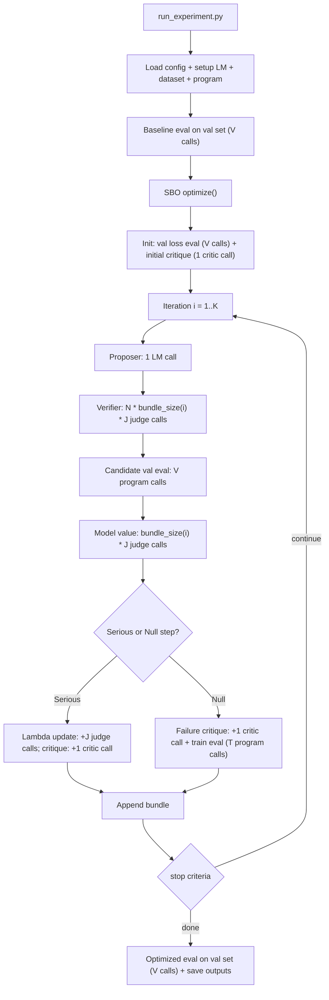

# DSPy Optimizer Benchmark Framework

A modular, config-driven framework for benchmarking DSPy prompt optimizers (GEPA, MIPROv2, COPRO, etc.) on various datasets.

## Local Setup

One-time environment setup from a fresh clone (or after a long break):

```bash
# From repo root. Requires Python >= 3.10, < 3.15 (3.12 recommended).
python3.12 -m venv .venv
source .venv/bin/activate
pip install --upgrade pip

# Install with dev tooling AND test_extras (datasets, pandas, optuna, langchain_core).
# test_extras is required — the benchmark data adapters import `datasets`.
pip install -e ".[dev,test_extras]"

# Optional: install pre-commit hooks for linting on commit
pre-commit install
```

Sanity check:

```bash
python -c "import dspy; print(dspy.__version__)"
```

Every subsequent session, just `source .venv/bin/activate` before running experiments.

**Need a model?** The default configs assume a local Ollama server with `qwen3:4b-instruct` at `http://localhost:11434`. Start it with `ollama serve` and `ollama pull qwen3:4b-instruct` before running experiments. Swap the `model_ref` in an experiment config to use a different model.

## Quick Start

```bash
# Run a baseline evaluation
python scripts/run_experiment.py configs/experiments/hotpotqa_baseline.yaml

# Run GEPA optimization
python scripts/run_experiment.py configs/experiments/hotpotqa_gepa_v1.yaml

# Run with detailed analysis and visualizations
python scripts/run_experiment_with_analysis.py configs/experiments/hotpotqa_gepa_v1.yaml

# Run AIME (math) baseline
python scripts/run_experiment.py configs/experiments/aime_baseline.yaml

# Run SBO (Semantic Bundle Optimization) with NaiveQA
python scripts/run_experiment.py configs/experiments/hotpotqa_sbo_naive.yaml
```

## Available Benchmarks

### HotPotQA (multi-hop reasoning)
Default benchmark. Uses the `mlflow_base_prompt` program with context. See configs under `configs/experiments/hotpotqa_*.yaml`.

### AIME (math competition)
Mathematical reasoning benchmark using `MathCoT` (ChainOfThought on `problem -> answer`).

- **Dataset**: 90 problems from 2022–2024 (split 45/45 train/val) + 30 from 2025 as test (repeated 5× → 150 test examples for stability).
  - Train/val: [`AI-MO/aimo-validation-aime`](https://huggingface.co/datasets/AI-MO/aimo-validation-aime)
  - Test: [`MathArena/aime_2025`](https://huggingface.co/datasets/MathArena/aime_2025)
- **Metric**: exact integer match. GEPA metric also returns the reference solution as feedback.
- **Configs**:
  - Dataset: `configs/datasets/aime_standard.yaml` (full) / `aime_fast.yaml` (5/3/5 for dev)
  - Program: `configs/programs/math_cot.yaml`
  - Experiments: `aime_baseline.yaml`, `aime_gepa_v1.yaml`, `aime_baseline_fast.yaml`, `aime_gepa_fast.yaml`

**Expected performance** (from the GEPA AIME tutorial, GPT-4.1 Mini reference): baseline ~46.7%, GEPA-optimized ~56.7%. Qwen3:4B numbers will differ.

### SBO with NaiveQA (fast iteration loop)
**NaiveQA** is the simplest program (single `question -> answer` predictor, no context). Pair it with `sbo_light` for quick SBO experiments:

```bash
# Baseline
python scripts/run_experiment.py configs/experiments/hotpotqa_naive_baseline.yaml

# SBO optimization (~10–15 min with a local 4B model)
python scripts/run_experiment.py configs/experiments/hotpotqa_sbo_naive.yaml
```

Watch for `✓ SERIOUS STEP` (real improvement) vs null steps (bundle refinement only) in the logs. The bundle grows every iteration; the serious/null ratio indicates whether SBO is still finding improvements.

## Architecture

### Modular Configuration System

Configs are organized into reusable, composable modules to ensure consistency and reduce duplication:

```
configs/
├── base/
│   └── logging.yaml              # Common logging settings
├── datasets/
│   └── hotpotqa_standard.yaml    # Dataset configurations
├── models/
│   └── qwen3_4b.yaml             # Model configurations
├── optimizers/
│   ├── baseline.yaml             # No optimization
│   ├── gepa.yaml                 # GEPA settings
│   └── mipro.yaml                # MIPROv2 settings
├── programs/
│   └── mlflow_base.yaml          # Program/signature configs
└── experiments/
    ├── hotpotqa_baseline.yaml    # Composed experiments
    ├── hotpotqa_gepa_v1.yaml
    └── hotpotqa_mipro_v1.yaml
```

### Benefits

- **Single Source of Truth**: Change dataset settings once, all experiments update
- **Consistency**: All experiments use identical base configurations
- **Easy Comparison**: Only differences between experiments are visible
- **Quick Testing**: Create variants without copying boilerplate

## Creating New Experiments

### Example: Experiment Config

```yaml
# configs/experiments/my_experiment.yaml
name: my_experiment
description: Testing GEPA with different settings

# Reference shared configs
dataset_ref: hotpotqa_standard
model_ref: qwen3_4b
optimizer_ref: gepa
program_ref: mlflow_base
logging_ref: logging

# Override only what's different
optimizer_overrides:
  params:
    max_metric_calls: 300  # Run longer
    
logging_overrides:
  save_models: true
```

### Creating New Shared Configs

**Dataset variant** (`configs/datasets/hotpotqa_small.yaml`):
```yaml
name: hotpotqa
train_size: 50
dev_size: 10
test_size: 0
train_seed: 1
eval_seed: 2023
keep_details: true
params:
  use_context: true
```

**Model variant** (`configs/models/llama3_8b.yaml`):
```yaml
name: ollama_chat/llama3:8b
api_base: http://localhost:11434
cache: true
params: {}
```

Then reference them in experiments:
```yaml
dataset_ref: hotpotqa_small  # Use smaller dataset
model_ref: llama3_8b          # Use different model
```

## Configuration Reference

### Dataset Configuration

```yaml
dataset:
  name: hotpotqa                  # Dataset name
  train_size: 200                 # Training examples for optimization
  dev_size: 20                    # Validation examples for tracking
  test_size: 0                    # Test set size (0 = no test)
  train_seed: 1                   # Random seed for train split
  eval_seed: 2023                 # Random seed for eval split
  keep_details: true              # Keep additional metadata
  params:
    use_context: true             # Dataset-specific parameters
```

### Model Configuration

```yaml
model:
  name: ollama_chat/qwen3:4b-instruct
  api_base: http://localhost:11434
  cache: true                     # Enable response caching
  params: {}                      # Additional model parameters
```

### Optimizer Configuration

**GEPA**:
```yaml
optimizer:
  name: gepa
  auto: light                     # Optimization mode
  num_threads: 1                  # Parallel threads
  params:
    reflection_lm: null           # null = use main model
    reflection_minibatch_size: 1  # Examples per reflection (1-3)
    max_metric_calls: 200         # Max optimization iterations
    track_stats: true             # Track detailed statistics
```

**Baseline** (no optimization):
```yaml
optimizer:
  name: baseline
  auto: light
  num_threads: 1
  params: {}
```

### Key Parameters for GEPA

| Parameter | Default | Recommended | Description |
|-----------|---------|-------------|-------------|
| `reflection_minibatch_size` | 3 | **1-2** for small models | Examples in reflection prompt |
| `train_size` | 50 | 100-300 | Training examples |
| `dev_size` | 100 | 10-50 | Validation examples |
| `max_metric_calls` | 200 | 200-500 | Max iterations |
| `cache` | true | false when debugging | Enable/disable caching |

### Context Window Considerations

⚠️ **Important**: HotPotQA examples contain long context passages. The reflection prompt sent to the reflection LM includes:
- Current instruction
- Multiple examples with full context, question, answer, and feedback

**Prompt size estimation**:
- Each HotPotQA example in the reflection prompt: ~5,000-15,000 characters
- With `reflection_minibatch_size=3`: prompts can exceed 20,000+ characters (~5,000-7,000 tokens)

**Recommendations by model size**:

| Model Size | `reflection_minibatch_size` | Notes |
|------------|----------------------------|-------|
| 4B-7B | 1 | Keep prompts short; may still truncate on long examples |
| 13B-30B | 1-2 | Better handling of longer contexts |
| 70B+ / API | 2-3 | Can handle full reflection prompts |

### Program Configuration

```yaml
program:
  name: mlflow_base_prompt        # Program type
  params: {}                      # Program-specific parameters
```

Available programs (see `programs/` directory):
- `mlflow_base_prompt`: Context-aware QA with pre-defined template
- `naive`: Direct question → answer
- `cot`: Chain-of-thought reasoning

### Troubleshooting

#### Empty or truncated instruction proposals

**Symptom**: GEPA logs show `Proposed new text for answer:` with empty or very short text.

**Causes**:
1. Reflection prompt too long for model's effective context
2. Model returns only code fences (````) without content

**Solutions**:
- Reduce `--reflection_minibatch_size` to 1
- Use a larger model for reflection (`--reflection_lm`)
- Add `max_tokens=4096` to the reflection LM (already configured)

#### "All subsample scores perfect. Skipping."

**Symptom**: GEPA skips reflection because the minibatch scored perfectly.

**Cause**: With small `reflection_minibatch_size`, you may randomly sample only "easy" examples.

**Solutions**:
- Increase `--train_size` for more diverse sampling
- Set `skip_perfect_score=False` in GEPA config (requires code change)

#### Proposals don't improve scores

**Symptom**: New instructions score worse than baseline on validation set.

**Cause**: The reflection LM may propose overly specific or incorrect heuristics based on the small minibatch.

**Solutions**:
- Increase `--train_size` for better coverage
- Use a stronger reflection model
- Run longer with more `max_metric_calls`

## Running Experiments

### Basic Execution

```bash
# Run a single experiment
python scripts/run_experiment.py configs/experiments/hotpotqa_baseline.yaml

# Run with analysis and visualizations
python scripts/run_experiment_with_analysis.py configs/experiments/hotpotqa_gepa_v1.yaml
```

### Results

Results are saved to:
- **Logs**: `results/logs/` - Detailed execution logs
- **Models**: `results/models/` - Optimized programs (if `save_models: true`)
- **Reports**: `results/reports/` - Analysis reports and plots

### Example Workflow

```bash
# 1. Run baseline
python scripts/run_experiment.py configs/experiments/hotpotqa_baseline.yaml

# 2. Run GEPA optimization
python scripts/run_experiment_with_analysis.py configs/experiments/hotpotqa_gepa_v1.yaml

# 3. Compare results (check results/logs/ for JSON files)
```

## Output Interpretation

### GEPA Candidate Inspection

After optimization, the script prints all proposed candidates:

```
============================================================
GEPA CANDIDATE INSPECTION
============================================================
Total candidates explored: 5
Best candidate index: 0
Best validation score: 0.7263

[Rank 1] Candidate 0 — Score: 0.7263 ★ BEST
  [answer]:
    You are a question answering assistant...

[Rank 2] Candidate 1 — Score: 0.4164
  [answer]:
    Given the fields `context`, `question`, produce the fields `answer`.
```

- **Candidate 0** is always the original/baseline
- If Candidate 0 remains best, optimization found no improvements
- Candidates with default DSPy signature (`Given the fields...`) indicate empty proposals

### Score Distribution

```
SCORE DISTRIBUTION
  Min:    0.3520
  Max:    0.5411
  Mean:   0.3917
```

- **High variance** (large Max-Min gap): proposals are exploring diverse strategies
- **Low mean with high max**: some proposals work well, others don't
- **All similar scores**: optimization is stuck or baseline is already optimal

## Project Structure

```
benchmarks/
├── configs/                      # Configuration files
│   ├── base/                    # Base configs (logging, etc.)
│   ├── datasets/                # Dataset configurations
│   ├── models/                  # Model configurations
│   ├── optimizers/              # Optimizer configurations
│   ├── programs/                # Program configurations
│   └── experiments/             # Experiment definitions
├── core/                        # Core framework
│   ├── config.py               # Config loading & composition
│   ├── experiment.py           # Experiment runner
│   ├── logging.py              # Logging utilities
│   ├── metrics.py              # Evaluation metrics
│   └── analysis.py             # Result analysis
├── programs/                    # DSPy program definitions
│   ├── base.py                 # Base program interface
│   └── qa.py                   # QA program implementations
├── data_adapters/              # Dataset loaders
│   └── hotpotqa_adapter.py    # HotPotQA loader
├── optimizers/                  # Optimizer wrappers
│   ├── baseline_optimizer.py
│   ├── gepa_optimizer.py
│   └── mipro_optimizer.py
├── scripts/                     # Entry point scripts
│   ├── run_experiment.py       # Basic runner
│   └── run_experiment_with_analysis.py  # Runner with analysis
└── results/                     # Output directory
    ├── logs/                   # Execution logs
    ├── models/                 # Saved models
    └── reports/                # Analysis reports
```

## Tips & Best Practices

### Configuration Tips

1. **Consistent Comparisons**: Always use the same `dataset_ref` for experiments you want to compare
2. **Quick Testing**: Create a `*_small.yaml` dataset config with reduced sizes for rapid iteration
3. **Version Control**: The small experiment configs make git diffs very readable
4. **Documentation**: Use descriptive names and include `description` fields

### Performance Tuning

1. **Small Models (4B-7B)**:
   - `reflection_minibatch_size: 1`
   - `train_size: 50-100`
   - `dev_size: 10-20`

2. **Medium Models (13B-30B)**:
   - `reflection_minibatch_size: 1-2`
   - `train_size: 100-200`
   - `dev_size: 20-50`

3. **Large Models/APIs (70B+)**:
   - `reflection_minibatch_size: 2-3`
   - `train_size: 200-500`
   - `dev_size: 50-100`

## Performance & Timing

Local models (especially on complex tasks like AIME) are slow. Know what to expect before assuming something is stuck.

### AIME timing (Qwen3:4B via Ollama)

| Task | Time |
|---|---|
| Simple question ("What is 2+2?") | ~1.8 s |
| Real AIME problem (CoT) | ~33 s (~18× slower) |
| Baseline eval on full val (10 ex) | ~5.5 min |
| Baseline eval on full test (150 ex) | ~82 min |
| GEPA full optimization | 45–60+ min |
| GEPA fast config (5 train / 3 val) | ~10–15 min ✓ |

For iteration, use `aime_baseline_fast.yaml` / `aime_gepa_fast.yaml` (dataset `aime_fast.yaml`, sizes 5/3/5).

### SBO timing (why it feels "stuck")

SBO is LM-call-intensive, not stuck. Each iteration does:

1. Proposer → 1 call (generates candidates)
2. Verifier → `num_candidates × bundle_size × num_judge_samples` calls
3. Candidate evaluation on val set → `dev_size` calls (per candidate)
4. Model value computation → `bundle_size × num_judge_samples` calls
5. Critique generation → 1 call

With defaults (3 candidates, 2 judge samples, dev_size=10) that's ~21 calls iter 1 and ~25 iter 2. At ~5–10 s/call on Qwen3:4B, budget ~2.5–3 min per iteration. 5 iterations ≈ 15 min.

**Knobs that shrink it fastest:**
- `dev_size` (biggest lever — every candidate is evaluated against it)
- `num_judge_samples: 1` (halves verifier calls)
- `num_candidates: 2`
- Use `sbo_light.yaml` or `hotpotqa_sbo_ultralight.yaml` for fastest iteration.

### General tips

- **Parallel eval**: `num_threads: 4` in optimizer overrides speeds up baseline evaluation but does not help GEPA/SBO (inherently sequential).
- **Disable cache during debugging** (`cache: false` in model config) to see true LM behavior.
- Run full evaluations overnight; use fast configs during development.


Absolutely — here’s a compact workflow chart plus a call-budget table for your **current config**:

- `train_size (T) = 50`
- `dev_size (V) = 25`
- `max_iterations (K) = 15`
- `num_candidates (N) = 3`
- `num_judge_samples (J) = 2`
- `num_threads = 2` (affects wall time, not call count)



## 1) Model calls per step (formulas)

| Step | LM type | Calls |
|---|---|---|
| Baseline eval (`ExperimentRunner`) | task model | `V` |
| SBO init val eval (`_evaluate_program`) | task model | `V` |
| Initial critique generation | critic LM | `1` |
| Initial critique failure sampling | task model | `S=min(3,T)` |
| Per iteration proposer | proposer LM | `1` |
| Per iteration verifier | judge LM | `N * b_i * J` |
| Per iteration candidate val eval | task model | `V` |
| Per iteration model-value calc | judge LM | `b_i * J` |
| Per iteration serious-step lambda update | judge LM | `J` (only if serious) |
| Per iteration critique (serious branch) | critic LM | `1` + `S` task calls |
| Per iteration failure critique (null branch) | critic LM | `1` + `T` task calls |
| Final optimized eval (`ExperimentRunner`) | task model | `V` |

Where `b_i` = bundle size at iteration `i` (starts at 1 and grows by 1 each iter).

---

## 2) Concrete counts with your config

### Per iteration `i`
- **Judge calls** = `N*b_i*J + b_i*J = 6b_i + 2b_i = 8b_i`
- **Proposer calls** = `1`
- **Critic calls** = `1`
- **Task model calls** = `V (=25)` plus:
  - serious step: `+3`
  - null step: `+50`

### If all 15 iterations run
- `sum(b_i, i=1..15) = 120`
- **Judge base total** = `8 * 120 = 960`
- **Judge extra from serious-step lambda updates** = `+2 * (#serious_steps)`
- **Proposer total** = `15`
- **Critic total** = `1 (initial) + 15 = 16`
- **Task model total** =  
  `50` (baseline+final evals)  
  `+ 25` (SBO init val)  
  `+ 25*15` (candidate val evals)  
  `+ 3` (initial critique sampling)  
  `+ 3*(#serious_steps) + 50*(#null_steps)`  

So:
- **Best-ish case (all serious)**: about `498` task-model calls
- **Null-heavy case (all null)**: about `1203` task-model calls  
  (often stops earlier due `max_null_steps`, but this is upper-bound if nulls are interleaved)

---

## 3) Prompt components + rough token estimates

| Call type | Prompt components | Input token estimate | Output token estimate |
|---|---|---:|---:|
| Task model (`naive` QA) | DSPy scaffold + instruction + question | ~50–180 | ~5–120 |
| Proposer LM | current prompt + current critique + generation instructions/rubric | ~300–900 | ~150–900 (all candidates text) |
| Judge LM | reference prompt + candidate prompt + critique + scoring rubric | ~250–700 | ~1–10 |
| Critique LM (initial/serious) | current prompt + up to 3 failure examples (input/gold/pred/score) + critique instructions | ~700–4000+ (can spike) | ~50–300 |
| Failure-critique LM (null) | candidate prompt + current/target loss + critique instructions | ~150–600 | ~50–250 |

The **big cost driver** is usually:
1) many task-model eval calls (`V`, `T` multipliers), and  
2) occasional very long critique prompts (especially when predictions are verbose).

If you want, I can generate a second table with **estimated total token volume per full run** under “mostly serious” vs “null-heavy” assumptions.