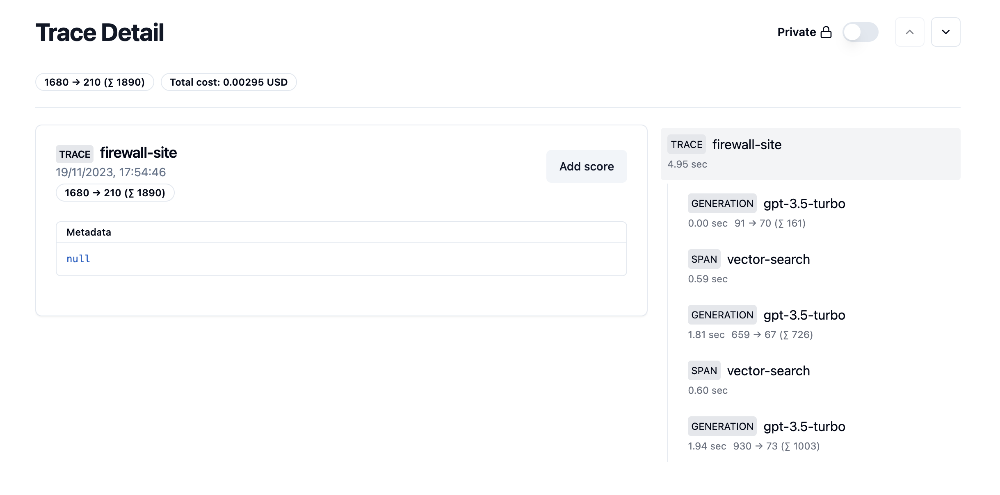

# DSPy Observability

## Overview

DSPy integrates with [langfuse](https://langfuse.com/) to provide observability into the DSPy programs. This includes the ability to trace the execution of a DSPy program, and to visualize the execution of a DSPy program.

## Pre-requisites

To use the observability features of DSPy, you must have a [langfuse cloud](https://cloud.langfuse.com/) account. This gives you full-control over the data that is collected, and allows you to visualize the execution of your DSPy programs in a cloud dashboard.

Make sure to grab the API key from your langfuse cloud account, as you will need it to configure DSPy.
```
LANGFUSE_SECRET_KEY="sk-lf-...";
LANGFUSE_PUBLIC_KEY="pk-lf-...";
```

## Setup

DSPy will automatically collect observability data for all DSPy programs that are run. To enable this, you must set the following environment variables: `LANGFUSE_PUBLIC_KEY` and `LANGFUSE_SECRET_KEY`. These can be set in your shell environment, or in the notebook itself.

For example, If you are running on notebook, you can set the environment variables in the notebook itself before you run `dspy.settings.configure(...)`:
```
import os
 
os.environ["LANGFUSE_PUBLIC_KEY"] = "sk-lf-..."
os.environ["LANGFUSE_SECRET_KEY"] = "pk-lf-..."
```

## Visualization

Once you have run a DSPy program, you can visualize the execution of the program in the langfuse cloud dashboard. To do this, go to the [langfuse cloud dashboard](https://cloud.langfuse.com/), and select your project tab. You should see a list of all the DSPy programs that you have run. Select the program that you want to visualize, and you should see a visualization of the execution of the program.



## Custom tracing

DSPy also provides a way to trace any arbitrary code. This can be useful for debugging, or supporting anything that we don't support out of the box. To do so, you can use the pre-initalized `dspy.settings.langfuse_trace` tracer. This tracer is a [langfuse tracer](https://langfuse.com/docs/integrations/sdk/python) that is configured to send data to your langfuse cloud account.

For more information on how to use the tracer, see the [langfuse documentation](https://langfuse.com/docs/integrations/sdk/python#3-record-a-more-complex-application).