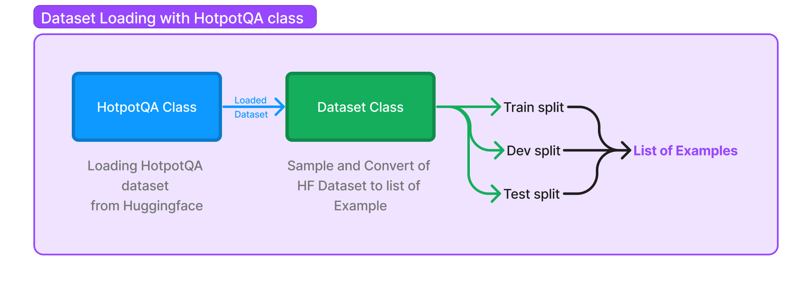

!!! warning "This page is outdated and may not be fully accurate in DSPy 2.5"

# Utilizing Built-in Datasets

It's easy to use your own data in DSPy: a dataset is just a list of `Example` objects. Using DSPy well involves being able to find and re-purpose existing datasets for your own pipelines in new ways; DSPy makes this a particularly powerful strategy.

For convenience, DSPy currently also provides support for the following dataset out of the box:

* **HotPotQA** (multi-hop question answering)
* **GSM8k** (math questions)
* **Color** (basic dataset of colors)


## Loading HotPotQA

HotPotQA is which is a collection of question-answer pairs.

```python
from dspy.datasets import HotPotQA

dataset = HotPotQA(train_seed=1, train_size=5, eval_seed=2023, dev_size=50, test_size=0)

print(dataset.train)
```
**Output:**
```text
[Example({'question': 'At My Window was released by which American singer-songwriter?', 'answer': 'John Townes Van Zandt'}) (input_keys=None),
 Example({'question': 'which  American actor was Candace Kita  guest starred with ', 'answer': 'Bill Murray'}) (input_keys=None),
 Example({'question': 'Which of these publications was most recently published, Who Put the Bomp or Self?', 'answer': 'Self'}) (input_keys=None),
 Example({'question': 'The Victorians - Their Story In Pictures is a documentary series written by an author born in what year?', 'answer': '1950'}) (input_keys=None),
 Example({'question': 'Which magazine has published articles by Scott Shaw, Tae Kwon Do Times or Southwest Art?', 'answer': 'Tae Kwon Do Times'}) (input_keys=None)]
```

We just loaded trainset (5 examples) and devset (50 examples). Each example in our training set contains just a question and its (human-annotated) answer. As you can see, it is loaded as a list of `Example` objects. However, one thing to note is that it doesn't set the input keys implicitly, so that is something that we'll need to do!!

```python
trainset = [x.with_inputs('question') for x in dataset.train]
devset = [x.with_inputs('question') for x in dataset.dev]

print(trainset)
```
**Output:**
```text
[Example({'question': 'At My Window was released by which American singer-songwriter?', 'answer': 'John Townes Van Zandt'}) (input_keys={'question'}),
 Example({'question': 'which  American actor was Candace Kita  guest starred with ', 'answer': 'Bill Murray'}) (input_keys={'question'}),
 Example({'question': 'Which of these publications was most recently published, Who Put the Bomp or Self?', 'answer': 'Self'}) (input_keys={'question'}),
 Example({'question': 'The Victorians - Their Story In Pictures is a documentary series written by an author born in what year?', 'answer': '1950'}) (input_keys={'question'}),
 Example({'question': 'Which magazine has published articles by Scott Shaw, Tae Kwon Do Times or Southwest Art?', 'answer': 'Tae Kwon Do Times'}) (input_keys={'question'})]
```

DSPy typically requires very minimal labeling. Whereas your pipeline may involve six or seven complex steps, you only need labels for the initial question and the final answer. DSPy will bootstrap any intermediate labels needed to support your pipeline. If you change your pipeline in any way, the data bootstrapped will change accordingly!


## Advanced: Inside DSPy's `Dataset` class (Optional)

We've seen how you can use `HotPotQA` dataset class and load the HotPotQA dataset, but how does it actually work? The `HotPotQA` class inherits from the `Dataset` class, which takes care of the conversion of the data loaded from a source into train-test-dev split, all of which are *list of examples*. In the `HotPotQA` class, you only implement the `__init__` method, where you populate the splits from HuggingFace into the variables `_train`, `_test` and `_dev`. The rest of the process is handled by methods in the `Dataset` class.



But how do the methods of the `Dataset` class convert the data from HuggingFace? Let's take a deep breath and think step by step...pun intended. In example above, we can see the splits accessed by `.train`, `.dev` and `.test` methods, so let's take a look at the implementation of the `train()` method:

```python
@property
def train(self):
    if not hasattr(self, '_train_'):
        self._train_ = self._shuffle_and_sample('train', self._train, self.train_size, self.train_seed)

    return self._train_
```

As you can see, the `train()` method serves as a property, not a regular method. Within this property, it first checks if the `_train_` attribute exists. If not, it calls the `_shuffle_and_sample()` method to process the `self._train` where the HuggingFace dataset is loaded. Let's see the  `_shuffle_and_sample()` method:

```python
def _shuffle_and_sample(self, split, data, size, seed=0):
    data = list(data)
    base_rng = random.Random(seed)

    if self.do_shuffle:
        base_rng.shuffle(data)

    data = data[:size]
    output = []

    for example in data:
        output.append(Example(**example, dspy_uuid=str(uuid.uuid4()), dspy_split=split))
    
        return output
```

The `_shuffle_and_sample()` method does two things:

* It shuffles the data if `self.do_shuffle` is True.
* It then takes a sample of size `size` from the shuffled data.
* It then loops through the sampled data and converts each element in `data` into an `Example` object. The `Example` along with example data also contains a unique ID, and the split name.

Converting the raw examples into `Example` objects allows the Dataset class to process them in a standardized way later. For example, the collate method, which is used by the PyTorch DataLoader, expects each item to be an `Example`.

To summarize, the `Dataset` class handles all the necessary data processing and provides a simple API to access the different splits. This differentiates from the dataset classes like HotpotQA which require only definitions on how to load the raw data.
