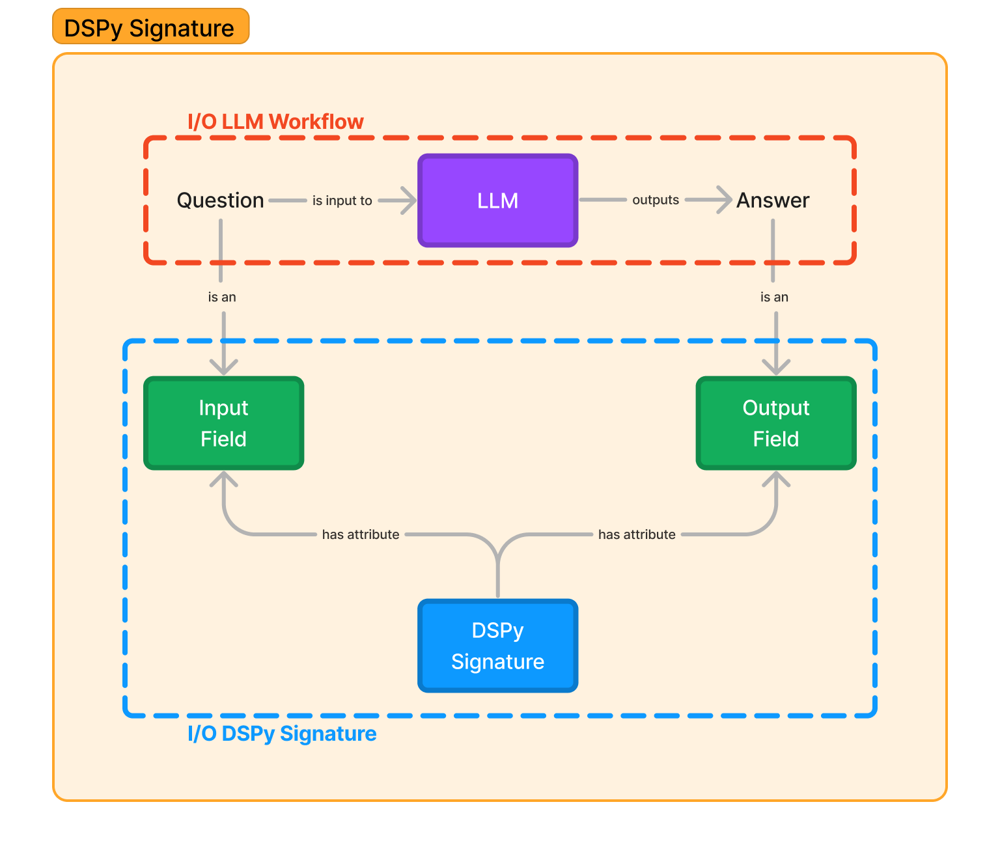

# Understanding Signatures

A DSPy Signature is the most basic form of task description which simply requires inputs and outputs and optionally, a small description about them and the task too.

There are 2 ways to define a Signature: **Inline** and **Class-Based**. But before diving into creating signatures, let's understand what a signature is and why we need it.

## What is a Signature?

In the typical LLM pipeline, you'll have two key components at work i.e. an LLM and a prompt. In DSPy, we have an LLM configured at the beginning of any DSPy script via the LM(Language Model - which is shown in the next blog) and a prompt defined via **Signatures**.

A Signature is usually composed of 2 essential components: **Input Fields** and **Output Fields**. You can optionally pass an instruction defining more robust requirements of your task. An **Input Field** is an attribute of Signature that defines an input to the prompt and an **Output Field** is an attribute of Signature that defines an output of the prompt received from an LLM call. Let's understand this by an example.



Let's think of a basic Question-Answer task where the question serves as an input to the LLM from which you receive an answer response. We directly map this in DSPy as the question serves as the Signature's **Input Field** and the answer as the Signature's **Output Field** .

Now that we understand the components of a Signature, let's see how we can declare a signature and what a prompt for that signature looks like.

## Inline Method

DSPy offers an intuitive, simple approach for defining tasks: simply state the inputs and outputs to convey the task in its simplest form. For example, if your input is **question** and output is **answer**, it should be clear that the task is a Question-Answer task. If your inputs are **context** and **question** and outputs are **answer** and **reason**, this should imply some form of Chain-Of-Thought prompting, potentially within a RAG pipeline.

Inspired by this simplicity, DSPy Signatures mirrors an Einops-like abstract manner:

```text
input_field_1,input_field_2,input_field_3...->output_field_1,output_field_2,output_field_3...
```

**Input Fields** of the Signature are declared on the left side of `->` with the **Output Fields** on the right side. So let's go ahead and define DSPy signatures for the QA and RAG tasks:

```text
QA Task: question->answer
RAG Task: context,question->answer,rationale
```

This simplistic naming of the fields is essential for the LLM to understand the nature of inputs and outputs, reducing sensitivity and ensuring clarity for expected inputs and generations. 

However, this barebones signature may not provide a clear picture for how the model should approach the task, and to meet these needs, DSPy modules offer simplistic yet robust instructional templates that integrate the Signatures.
Let's take a deeper look at the prompt constructed by DSPy to understand it better when used within a `dspy.Predict` module as `dspy.Predict(question->answer)`:

```
Given the fields `question`, produce the fields `answer`.

---

Follow the following format.

Question: ${question}
Answer: ${answer}

---

Question:
```

As you can see, DSPy populates the instruction `Given the fields ``question``, produce the fields ``answer``.` to define the task and provides instructions for the prompt format. And this format is pretty standard for any Signature you create as we can see in this prompting setup for RAG:


Now these instructional templates are well defined for their respective prompting techniques (CoT, ProgramOfThought, ReAct), leaving the user only having to define their task's Signature input and outputs with the rest handled by the DSPy modules library!

However, it would be nice to give more instructions beyond the simplistic in-line signature and for this, we turn to class-based signatures.

## Class Based Method

A Signature class comprises of three things:

* **Task Description/Instruction:** We define in the signature class docstring.
* **Inputs Field:** We define these as `dspy.InputField()`.
* **Outputs Field:** We define these as `dspy.OutputField()`.

```python
class BasicQA(dspy.Signature):
    """Answer questions with short factoid answers."""

    question = dspy.InputField()
    answer = dspy.OutputField(desc="often between 1 and 5 words", prefix="Question's Answer:")
```

The I/O Fields take 3 inputs: `desc`, `prefix` and `format`. `desc` is the description to the input, `prefix` is the placeholder text of the field in the prompt(one that has been `${field_name}` until now) and `format` which is a method that'll define how to handle non-string inputs. If the input to field is a list rather than a string, we can specify this through `format`.

Both `InputField` and `OutputField` are similar in implementation as well:

```python
class InputField(Field):
    def __init__(self, *, prefix=None, desc=None, format=None):
        super().__init__(prefix=prefix, desc=desc, input=True, format=format)

class OutputField(Field):
    def __init__(self, *, prefix=None, desc=None, format=None):
        super().__init__(prefix=prefix, desc=desc, input=False, format=format)
```

Let's take a look at how a prompt for the class based signature looks like:

```text
Answer questions with short factoid answers.

---

Follow the following format.

Question: ${question}
Question's Answer: often between 1 and 5 words

---

Question:
```

As you can see, the instruction is more well-defined by our task's instruction in the docstring. The prefix and description for the `answer` field reflects our definitions. This ensures a more refined prompt structure, giving the user more control on defining its contents per task requirements.


***
