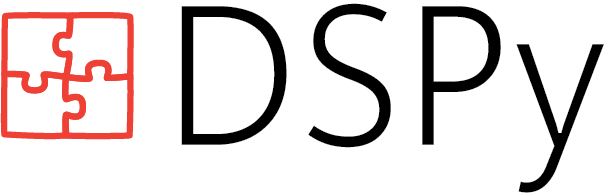

{ width="200", align=left }

# _Programming_—not prompting—_LMs_

[](https://pepy.tech/projects/dspy)

DSPy is a declarative framework for building modular AI software. It allows you to **iterate fast on structured code**, rather than brittle strings, and offers algorithms that **compile AI programs into effective prompts and weights** for your language models, whether you're building simple classifiers, sophisticated RAG pipelines, or Agent loops.

Instead of wrangling prompts or training jobs, DSPy (Declarative Self-improving Python) enables you to **build AI software from natural-language modules** and to _generically compose them_ with different models, inference strategies, or learning algorithms. This makes AI software **more reliable, maintainable, and portable** across models and strategies.

*tl;dr* Think of DSPy as a higher-level language for AI programming ([lecture](https://www.youtube.com/watch?v=JEMYuzrKLUw)), like the shift from assembly to C or pointer arithmetic to SQL. Meet the community, seek help, or start contributing via [GitHub](https://github.com/stanfordnlp/dspy) and [Discord](https://discord.gg/XCGy2WDCQB).

<!-- Its abstractions make your AI software more reliable and maintainable, and allow it to become more portable as new models and learning techniques emerge. It's also just rather elegant! -->

!!! info "Getting Started I: Install DSPy and set up your LM"

    ```bash
    > pip install -U dspy
    ```

    === "OpenAI"
        You can authenticate by setting the `OPENAI_API_KEY` env variable or passing `api_key` below.

        ```python linenums="1"
        import dspy
        lm = dspy.LM("openai/gpt-4o-mini", api_key="YOUR_OPENAI_API_KEY")
        dspy.configure(lm=lm)
        ```

    === "Anthropic"
        You can authenticate by setting the `ANTHROPIC_API_KEY` env variable or passing `api_key` below.

        ```python linenums="1"
        import dspy
        lm = dspy.LM("anthropic/claude-sonnet-4-5-20250929", api_key="YOUR_ANTHROPIC_API_KEY")
        dspy.configure(lm=lm)
        ```

    === "Databricks"
        If you're on the Databricks platform, authentication is automatic via their SDK. If not, you can set the env variables `DATABRICKS_API_KEY` and `DATABRICKS_API_BASE`, or pass `api_key` and `api_base` below.

        ```python linenums="1"
        import dspy
        lm = dspy.LM(
            "databricks/databricks-llama-4-maverick",
            api_key="YOUR_DATABRICKS_ACCESS_TOKEN",
            api_base="YOUR_DATABRICKS_WORKSPACE_URL",  # e.g.: https://dbc-64bf4923-e39e.cloud.databricks.com/serving-endpoints
        )
        dspy.configure(lm=lm)
        ```

    === "Gemini"
        You can authenticate by setting the `GEMINI_API_KEY` env variable or passing `api_key` below.

        ```python linenums="1"
        import dspy
        lm = dspy.LM("gemini/gemini-2.5-flash", api_key="YOUR_GEMINI_API_KEY")
        dspy.configure(lm=lm)
        ```

    === "Local LMs on your laptop"
          First, install [Ollama](https://github.com/ollama/ollama) and launch its server with your LM.

          ```bash
          > curl -fsSL https://ollama.ai/install.sh | sh
          > ollama run llama3.2:1b
          ```

          Then, connect to it from your DSPy code.

        ```python linenums="1"
        import dspy
        lm = dspy.LM("ollama_chat/llama3.2:1b", api_base="http://localhost:11434", api_key="")
        dspy.configure(lm=lm)
        ```

    === "Local LMs on a GPU server"
          First, install [SGLang](https://docs.sglang.ai/get_started/install.html) and launch its server with your LM.

          ```bash
          > pip install "sglang[all]"
          > pip install flashinfer -i https://flashinfer.ai/whl/cu121/torch2.4/ 

          > CUDA_VISIBLE_DEVICES=0 python -m sglang.launch_server --port 7501 --model-path meta-llama/Llama-3.1-8B-Instruct
          ```
        
        If you don't have access from Meta to download `meta-llama/Llama-3.1-8B-Instruct`, use `Qwen/Qwen2.5-7B-Instruct` for example.

        Next, connect to your local LM from your DSPy code as an `OpenAI`-compatible endpoint.

          ```python linenums="1"
          lm = dspy.LM("openai/meta-llama/Llama-3.1-8B-Instruct",
                       api_base="http://localhost:7501/v1",  # ensure this points to your port
                       api_key="local", model_type="chat")
          dspy.configure(lm=lm)
          ```

    === "Other providers"
        In DSPy, you can use any of the dozens of [LLM providers supported by LiteLLM](https://docs.litellm.ai/docs/providers). Simply follow their instructions for which `{PROVIDER}_API_KEY` to set and how to write pass the `{provider_name}/{model_name}` to the constructor.

        Some examples:

        - `anyscale/mistralai/Mistral-7B-Instruct-v0.1`, with `ANYSCALE_API_KEY`
        - `together_ai/togethercomputer/llama-2-70b-chat`, with `TOGETHERAI_API_KEY`
        - `sagemaker/<your-endpoint-name>`, with `AWS_ACCESS_KEY_ID`, `AWS_SECRET_ACCESS_KEY`, and `AWS_REGION_NAME`
        - `azure/<your_deployment_name>`, with `AZURE_API_KEY`, `AZURE_API_BASE`, `AZURE_API_VERSION`, and the optional `AZURE_AD_TOKEN` and `AZURE_API_TYPE`

        
        If your provider offers an OpenAI-compatible endpoint, just add an `openai/` prefix to your full model name.

        ```python linenums="1"
        import dspy
        lm = dspy.LM("openai/your-model-name", api_key="PROVIDER_API_KEY", api_base="YOUR_PROVIDER_URL")
        dspy.configure(lm=lm)
        ```

??? "Calling the LM directly."

     Idiomatic DSPy involves using _modules_, which we define in the rest of this page. However, it's still easy to call the `lm` you configured above directly. This gives you a unified API and lets you benefit from utilities like automatic caching.

     ```python linenums="1"       
     lm("Say this is a test!", temperature=0.7)  # => ['This is a test!']
     lm(messages=[{"role": "user", "content": "Say this is a test!"}])  # => ['This is a test!']
     ``` 


## 1) **Modules** help you describe AI behavior as _code_, not strings.

To build reliable AI systems, you must iterate fast. But maintaining prompts makes that hard: it forces you to tinker with strings or data _every time you change your LM, metrics, or pipeline_. Having built over a dozen best-in-class compound LM systems since 2020, we learned this the hard way—and so built DSPy to decouple AI system design from messy incidental choices about specific LMs or prompting strategies.

DSPy shifts your focus from tinkering with prompt strings to **programming with structured and declarative natural-language modules**. For every AI component in your system, you specify input/output behavior as a _signature_ and select a _module_ to assign a strategy for invoking your LM. DSPy expands your signatures into prompts and parses your typed outputs, so you can compose different modules together into ergonomic, portable, and optimizable AI systems.


!!! info "Getting Started II: Build DSPy modules for various tasks"
    Try the examples below after configuring your `lm` above. Adjust the fields to explore what tasks your LM can do well out of the box. Each tab below sets up a DSPy module, like `dspy.Predict`, `dspy.ChainOfThought`, or `dspy.ReAct`, with a task-specific _signature_. For example, `question -> answer: float` tells the module to take a question and to produce a `float` answer.

    === "Math"

        ```python linenums="1"
        math = dspy.ChainOfThought("question -> answer: float")
        math(question="Two dice are tossed. What is the probability that the sum equals two?")
        ```
        
        **Possible Output:**
        ```text
        Prediction(
            reasoning='When two dice are tossed, each die has 6 faces, resulting in a total of 6 x 6 = 36 possible outcomes. The sum of the numbers on the two dice equals two only when both dice show a 1. This is just one specific outcome: (1, 1). Therefore, there is only 1 favorable outcome. The probability of the sum being two is the number of favorable outcomes divided by the total number of possible outcomes, which is 1/36.',
            answer=0.0277776
        )
        ```

    === "RAG"

        ```python linenums="1"       
        def search_wikipedia(query: str) -> list[str]:
            results = dspy.ColBERTv2(url="http://20.102.90.50:2017/wiki17_abstracts")(query, k=3)
            return [x["text"] for x in results]
        
        rag = dspy.ChainOfThought("context, question -> response")

        question = "What's the name of the castle that David Gregory inherited?"
        rag(context=search_wikipedia(question), question=question)
        ```
        
        **Possible Output:**
        ```text
        Prediction(
            reasoning='The context provides information about David Gregory, a Scottish physician and inventor. It specifically mentions that he inherited Kinnairdy Castle in 1664. This detail directly answers the question about the name of the castle that David Gregory inherited.',
            response='Kinnairdy Castle'
        )
        ```

    === "Classification"

        ```python linenums="1"
        from typing import Literal

        class Classify(dspy.Signature):
            """Classify sentiment of a given sentence."""
            
            sentence: str = dspy.InputField()
            sentiment: Literal["positive", "negative", "neutral"] = dspy.OutputField()
            confidence: float = dspy.OutputField()

        classify = dspy.Predict(Classify)
        classify(sentence="This book was super fun to read, though not the last chapter.")
        ```
        
        **Possible Output:**

        ```text
        Prediction(
            sentiment='positive',
            confidence=0.75
        )
        ```

    === "Information Extraction"

        ```python linenums="1"        
        class ExtractInfo(dspy.Signature):
            """Extract structured information from text."""
            
            text: str = dspy.InputField()
            title: str = dspy.OutputField()
            headings: list[str] = dspy.OutputField()
            entities: list[dict[str, str]] = dspy.OutputField(desc="a list of entities and their metadata")
        
        module = dspy.Predict(ExtractInfo)

        text = "Apple Inc. announced its latest iPhone 14 today." \
            "The CEO, Tim Cook, highlighted its new features in a press release."
        response = module(text=text)

        print(response.title)
        print(response.headings)
        print(response.entities)
        ```
        
        **Possible Output:**
        ```text
        Apple Inc. Announces iPhone 14
        ['Introduction', "CEO's Statement", 'New Features']
        [{'name': 'Apple Inc.', 'type': 'Organization'}, {'name': 'iPhone 14', 'type': 'Product'}, {'name': 'Tim Cook', 'type': 'Person'}]
        ```

    === "Agents"

        ```python linenums="1"       
        def evaluate_math(expression: str):
            return dspy.PythonInterpreter({}).execute(expression)

        def search_wikipedia(query: str):
            results = dspy.ColBERTv2(url="http://20.102.90.50:2017/wiki17_abstracts")(query, k=3)
            return [x["text"] for x in results]

        react = dspy.ReAct("question -> answer: float", tools=[evaluate_math, search_wikipedia])

        pred = react(question="What is 9362158 divided by the year of birth of David Gregory of Kinnairdy castle?")
        print(pred.answer)
        ```
        
        **Possible Output:**

        ```text
        5761.328
        ```
    
    === "Multi-Stage Pipelines"

        ```python linenums="1"       
        class Outline(dspy.Signature):
            """Outline a thorough overview of a topic."""
            
            topic: str = dspy.InputField()
            title: str = dspy.OutputField()
            sections: list[str] = dspy.OutputField()
            section_subheadings: dict[str, list[str]] = dspy.OutputField(desc="mapping from section headings to subheadings")

        class DraftSection(dspy.Signature):
            """Draft a top-level section of an article."""
            
            topic: str = dspy.InputField()
            section_heading: str = dspy.InputField()
            section_subheadings: list[str] = dspy.InputField()
            content: str = dspy.OutputField(desc="markdown-formatted section")

        class DraftArticle(dspy.Module):
            def __init__(self):
                self.build_outline = dspy.ChainOfThought(Outline)
                self.draft_section = dspy.ChainOfThought(DraftSection)

            def forward(self, topic):
                outline = self.build_outline(topic=topic)
                sections = []
                for heading, subheadings in outline.section_subheadings.items():
                    section, subheadings = f"## {heading}", [f"### {subheading}" for subheading in subheadings]
                    section = self.draft_section(topic=outline.title, section_heading=section, section_subheadings=subheadings)
                    sections.append(section.content)
                return dspy.Prediction(title=outline.title, sections=sections)

        draft_article = DraftArticle()
        article = draft_article(topic="World Cup 2002")
        ```
        
        **Possible Output:**

        A 1500-word article on the topic, e.g.

        ```text
        ## Qualification Process

        The qualification process for the 2002 FIFA World Cup involved a series of..... [shortened here for presentation].

        ### UEFA Qualifiers

        The UEFA qualifiers involved 50 teams competing for 13..... [shortened here for presentation].

        .... [rest of the article]
        ```

        Note that DSPy makes it straightforward to optimize multi-stage modules like this. As long as you can evaluate the _final_ output of the system, every DSPy optimizer can tune all of the intermediate modules.

??? "Using DSPy in practice: from quick scripting to building sophisticated systems."

    Standard prompts conflate interface ("what should the LM do?") with implementation ("how do we tell it to do that?"). DSPy isolates the former as _signatures_ so we can infer the latter or learn it from data — in the context of a bigger program.
    
    Even before you start using optimizers, DSPy's modules allow you to script effective LM systems as ergonomic, portable _code_. Across many tasks and LMs, we maintain _signature test suites_ that assess the reliability of the built-in DSPy adapters. Adapters are the components that map signatures to prompts prior to optimization. If you find a task where a simple prompt consistently outperforms idiomatic DSPy for your LM, consider that a bug and [file an issue](https://github.com/stanfordnlp/dspy/issues). We'll use this to improve the built-in adapters.


## 2) **Optimizers** tune the prompts and weights of your AI modules.

DSPy provides you with the tools to compile high-level code with natural language annotations into the low-level computations, prompts, or weight updates that align your LM with your program's structure and metrics. If you change your code or your metrics, you can simply re-compile accordingly.

Given a few tens or hundreds of representative _inputs_ of your task and a _metric_ that can measure the quality of your system's outputs, you can use a DSPy optimizer. Different optimizers in DSPy work by **synthesizing good few-shot examples** for every module, like `dspy.BootstrapRS`,<sup>[1](https://arxiv.org/abs/2310.03714)</sup> **proposing and intelligently exploring better natural-language instructions** for every prompt, like [`dspy.GEPA`](https://dspy.ai/tutorials/gepa_ai_program/)<sup>[2](https://arxiv.org/abs/2507.19457)</sup>, `dspy.MIPROv2`,<sup>[3](https://arxiv.org/abs/2406.11695)</sup> and **building datasets for your modules and using them to finetune the LM weights** in your system, like `dspy.BootstrapFinetune`.<sup>[4](https://arxiv.org/abs/2407.10930)</sup> For detailed tutorials on running `dspy.GEPA`, please take a look at [dspy.GEPA tutorials](https://dspy.ai/tutorials/gepa_ai_program/).


!!! info "Getting Started III: Optimizing the LM prompts or weights in DSPy programs"
    A typical simple optimization run costs on the order of $2 USD and takes around 20 minutes, but be careful when running optimizers with very large LMs or very large datasets.
    Optimization can cost as little as a few cents or up to tens of dollars, depending on your LM, dataset, and configuration.

    Examples below rely on HuggingFace/datasets, you can install it by the command below.

    ```bash
    > pip install -U datasets
    ```

    === "Optimizing prompts for a ReAct agent"
        This is a minimal but fully runnable example of setting up a `dspy.ReAct` agent that answers questions via
        search from Wikipedia and then optimizing it using `dspy.MIPROv2` in the cheap `light` mode on 500
        question-answer pairs sampled from the `HotPotQA` dataset.

        ```python linenums="1"
        import dspy
        from dspy.datasets import HotPotQA

        dspy.configure(lm=dspy.LM("openai/gpt-4o-mini"))

        def search_wikipedia(query: str) -> list[str]:
            results = dspy.ColBERTv2(url="http://20.102.90.50:2017/wiki17_abstracts")(query, k=3)
            return [x["text"] for x in results]

        trainset = [x.with_inputs('question') for x in HotPotQA(train_seed=2024, train_size=500).train]
        react = dspy.ReAct("question -> answer", tools=[search_wikipedia])

        tp = dspy.MIPROv2(metric=dspy.evaluate.answer_exact_match, auto="light", num_threads=24)
        optimized_react = tp.compile(react, trainset=trainset)
        ```

        An informal run like this raises ReAct's score from 24% to 51%, by teaching `gpt-4o-mini` more about the specifics of the task.

    === "Optimizing prompts for RAG"
        Given a retrieval index to `search`, your favorite `dspy.LM`, and a small `trainset` of questions and ground-truth responses, the following code snippet can optimize your RAG system with long outputs against the built-in `SemanticF1` metric, which is implemented as a DSPy module.

        ```python linenums="1"
        class RAG(dspy.Module):
            def __init__(self, num_docs=5):
                self.num_docs = num_docs
                self.respond = dspy.ChainOfThought("context, question -> response")

            def forward(self, question):
                context = search(question, k=self.num_docs)   # defined in tutorial linked below
                return self.respond(context=context, question=question)

        tp = dspy.MIPROv2(metric=dspy.evaluate.SemanticF1(decompositional=True), auto="medium", num_threads=24)
        optimized_rag = tp.compile(RAG(), trainset=trainset, max_bootstrapped_demos=2, max_labeled_demos=2)
        ```

        For a complete RAG example that you can run, start this [tutorial](tutorials/rag/index.ipynb). It improves the quality of a RAG system over a subset of StackExchange communities by 10% relative gain.

    === "Optimizing weights for Classification"
        <details><summary>Click to show dataset setup code.</summary>

        ```python linenums="1"
        import random
        from typing import Literal

        from datasets import load_dataset

        import dspy
        from dspy.datasets import DataLoader

        # Load the Banking77 dataset.
        CLASSES = load_dataset("PolyAI/banking77", split="train", trust_remote_code=True).features["label"].names
        kwargs = {"fields": ("text", "label"), "input_keys": ("text",), "split": "train", "trust_remote_code": True}

        # Load the first 2000 examples from the dataset, and assign a hint to each *training* example.
        trainset = [
            dspy.Example(x, hint=CLASSES[x.label], label=CLASSES[x.label]).with_inputs("text", "hint")
            for x in DataLoader().from_huggingface(dataset_name="PolyAI/banking77", **kwargs)[:2000]
        ]
        random.Random(0).shuffle(trainset)
        ```
        </details>

        ```python linenums="1"
        import dspy
        lm=dspy.LM('openai/gpt-4o-mini-2024-07-18')

        # Define the DSPy module for classification. It will use the hint at training time, if available.
        signature = dspy.Signature("text, hint -> label").with_updated_fields("label", type_=Literal[tuple(CLASSES)])
        classify = dspy.ChainOfThought(signature)
        classify.set_lm(lm)

        # Optimize via BootstrapFinetune.
        optimizer = dspy.BootstrapFinetune(metric=(lambda x, y, trace=None: x.label == y.label), num_threads=24)
        optimized = optimizer.compile(classify, trainset=trainset)

        optimized(text="What does a pending cash withdrawal mean?")
        
        # For a complete fine-tuning tutorial, see: https://dspy.ai/tutorials/classification_finetuning/
        ```

        **Possible Output (from the last line):**
        ```text
        Prediction(
            reasoning='A pending cash withdrawal indicates that a request to withdraw cash has been initiated but has not yet been completed or processed. This status means that the transaction is still in progress and the funds have not yet been deducted from the account or made available to the user.',
            label='pending_cash_withdrawal'
        )
        ```

        An informal run similar to this on DSPy 2.5.29 raises GPT-4o-mini's score 66% to 87%.


??? "What's an example of a DSPy optimizer? How do different optimizers work?"

    Take the `dspy.MIPROv2` optimizer as an example. First, MIPRO starts with the **bootstrapping stage**. It takes your program, which may be unoptimized at this point, and runs it many times across different inputs to collect traces of input/output behavior for each one of your modules. It filters these traces to keep only those that appear in trajectories scored highly by your metric. Second, MIPRO enters its **grounded proposal stage**. It previews your DSPy program's code, your data, and traces from running your program, and uses them to draft many potential instructions for every prompt in your program. Third, MIPRO launches the **discrete search stage**. It samples mini-batches from your training set, proposes a combination of instructions and traces to use for constructing every prompt in the pipeline, and evaluates the candidate program on the mini-batch. Using the resulting score, MIPRO updates a surrogate model that helps the proposals get better over time.

    One thing that makes DSPy optimizers so powerful is that they can be composed. You can run `dspy.MIPROv2` and use the produced program as an input to `dspy.MIPROv2` again or, say, to `dspy.BootstrapFinetune` to get better results. This is partly the essence of `dspy.BetterTogether`. Alternatively, you can run the optimizer and then extract the top-5 candidate programs and build a `dspy.Ensemble` of them. This allows you to scale _inference-time compute_ (e.g., ensembles) as well as DSPy's unique _pre-inference time compute_ (i.e., optimization budget) in highly systematic ways.


<!-- Future:
BootstrapRS or MIPRO on ??? with a local SGLang LM
BootstrapFS on MATH with a tiny LM like Llama-3.2 with Ollama (maybe with a big teacher) -->


## 3) **DSPy's Ecosystem** advances open-source AI research.

Compared to monolithic LMs, DSPy's modular paradigm enables a large community to improve the compositional architectures, inference-time strategies, and optimizers for LM programs in an open, distributed way. This gives DSPy users more control, helps them iterate much faster, and allows their programs to get better over time by applying the latest optimizers or modules.

The DSPy research effort started at Stanford NLP in Feb 2022, building on what we had learned from developing early [compound LM systems](https://bair.berkeley.edu/blog/2024/02/18/compound-ai-systems/) like [ColBERT-QA](https://arxiv.org/abs/2007.00814), [Baleen](https://arxiv.org/abs/2101.00436), and [Hindsight](https://arxiv.org/abs/2110.07752). The first version was released as [DSP](https://arxiv.org/abs/2212.14024) in Dec 2022 and evolved by Oct 2023 into [DSPy](https://arxiv.org/abs/2310.03714). Thanks to [250 contributors](https://github.com/stanfordnlp/dspy/graphs/contributors), DSPy has introduced tens of thousands of people to building and optimizing modular LM programs.

Since then, DSPy's community has produced a large body of work on optimizers, like [MIPROv2](https://arxiv.org/abs/2406.11695), [BetterTogether](https://arxiv.org/abs/2407.10930), and [LeReT](https://arxiv.org/abs/2410.23214), on program architectures, like [STORM](https://arxiv.org/abs/2402.14207), [IReRa](https://arxiv.org/abs/2401.12178), and [DSPy Assertions](https://arxiv.org/abs/2312.13382), and on successful applications to new problems, like [PAPILLON](https://arxiv.org/abs/2410.17127), [PATH](https://arxiv.org/abs/2406.11706), [WangLab@MEDIQA](https://arxiv.org/abs/2404.14544), [UMD's Prompting Case Study](https://arxiv.org/abs/2406.06608), and [Haize's Red-Teaming Program](https://blog.haizelabs.com/posts/dspy/), in addition to many open-source projects, production applications, and other [use cases](community/use-cases.md).
