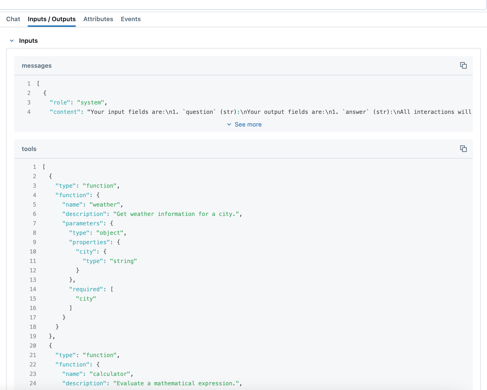

# Tools

DSPy provides powerful support for **tool-using agents** that can interact with external functions, APIs, and services. Tools enable language models to go beyond text generation by performing actions, retrieving information, and processing data dynamically.

There are two main approaches to using tools in DSPy:

1. **`dspy.ReAct`** - A fully managed tool agent that handles reasoning and tool calls automatically
2. **Manual tool handling** - Direct control over tool calls using `dspy.Tool`, `dspy.ToolCalls`, and custom signatures

## Approach 1: Using `dspy.ReAct` (Fully Managed)

The `dspy.ReAct` module implements the Reasoning and Acting (ReAct) pattern, where the language model iteratively reasons about the current situation and decides which tools to call.

### Basic Example

```python
import dspy

# Define your tools as functions
def get_weather(city: str) -> str:
    """Get the current weather for a city."""
    # In a real implementation, this would call a weather API
    return f"The weather in {city} is sunny and 75°F"

def search_web(query: str) -> str:
    """Search the web for information."""
    # In a real implementation, this would call a search API
    return f"Search results for '{query}': [relevant information...]"

# Create a ReAct agent
react_agent = dspy.ReAct(
    signature="question -> answer",
    tools=[get_weather, search_web],
    max_iters=5
)

# Use the agent
result = react_agent(question="What's the weather like in Tokyo?")
print(result.answer)
print("Tool calls made:", result.trajectory)
```

### ReAct Features

- **Automatic reasoning**: The model thinks through the problem step by step
- **Tool selection**: Automatically chooses which tool to use based on the situation
- **Iterative execution**: Can make multiple tool calls to gather information
- **Error handling**: Built-in error recovery for failed tool calls
- **Trajectory tracking**: Complete history of reasoning and tool calls

### ReAct Parameters

```python
react_agent = dspy.ReAct(
    signature="question -> answer",  # Input/output specification
    tools=[tool1, tool2, tool3],     # List of available tools
    max_iters=10                     # Maximum number of tool call iterations
)
```

## Approach 2: Manual Tool Handling

For more control over the tool calling process, you can manually handle tools using DSPy's tool types.

!!! note "Version Requirement"
    The `ToolCall.execute()` method used in the examples below is available from **dspy 3.0.4b2** onwards. If you're using version 3.0.3 or earlier, you'll need to upgrade to use this feature.

### Basic Setup

```python
import dspy

class ToolSignature(dspy.Signature):
    """Signature for manual tool handling."""
    question: str = dspy.InputField()
    tools: list[dspy.Tool] = dspy.InputField()
    outputs: dspy.ToolCalls = dspy.OutputField()

def weather(city: str) -> str:
    """Get weather information for a city."""
    return f"The weather in {city} is sunny"

def calculator(expression: str) -> str:
    """Evaluate a mathematical expression."""
    try:
        result = eval(expression)  # Note: Use safely in production
        return f"The result is {result}"
    except:
        return "Invalid expression"

# Create tool instances
tools = {
    "weather": dspy.Tool(weather),
    "calculator": dspy.Tool(calculator)
}

# Create predictor
predictor = dspy.Predict(ToolSignature)

# Make a prediction
response = predictor(
    question="What's the weather in New York?",
    tools=list(tools.values())
)

# Execute the tool calls
for call in response.outputs.tool_calls:
    # Execute the tool call
    result = call.execute()
    # For versions earlier than 3.0.4b2, use: result = tools[call.name](**call.args)
    print(f"Tool: {call.name}")
    print(f"Args: {call.args}")
    print(f"Result: {result}")
```

### Understanding `dspy.Tool`

The `dspy.Tool` class wraps regular Python functions to make them compatible with DSPy's tool system:

```python
def my_function(param1: str, param2: int = 5) -> str:
    """A sample function with parameters."""
    return f"Processed {param1} with value {param2}"

# Create a tool
tool = dspy.Tool(my_function)

# Tool properties
print(tool.name)        # "my_function"
print(tool.desc)        # The function's docstring
print(tool.args)        # Parameter schema
print(str(tool))        # Full tool description
```

### Understanding `dspy.ToolCalls`

!!! note "Version Requirement"
    The `ToolCall.execute()` method is available from **dspy 3.0.4b2** onwards. If you're using an earlier version, you'll need to upgrade to use this feature.

The `dspy.ToolCalls` type represents the output from a model that can make tool calls. Each individual tool call can be executed using the `execute` method:

```python
# After getting a response with tool calls
for call in response.outputs.tool_calls:
    print(f"Tool name: {call.name}")
    print(f"Arguments: {call.args}")
    
    # Execute individual tool calls with different options:
    
    # Option 1: Automatic discovery (finds functions in locals/globals)
    result = call.execute()  # Automatically finds functions by name

    # Option 2: Pass tools as a dict (most explicit)
    result = call.execute(functions={"weather": weather, "calculator": calculator})
    
    # Option 3: Pass Tool objects as a list
    result = call.execute(functions=[dspy.Tool(weather), dspy.Tool(calculator)])
    
    # Option 4: For versions earlier than 3.0.4b2 (manual tool lookup)
    # tools_dict = {"weather": weather, "calculator": calculator}
    # result = tools_dict[call.name](**call.args)
    
    print(f"Result: {result}")
```

## Using Native Tool Calling

DSPy adapters support **native function calling**, which leverages the underlying language model's built-in tool calling capabilities rather
than relying on text-based parsing. This approach can provide more reliable tool execution and better integration with models that support
native function calling.

!!! warning "Native tool calling doesn't guarantee better quality"

    It's possible that native tool calling produces lower quality than custom tool calling.

### Adapter Behavior

Different DSPy adapters have different defaults for native function calling:

- **`ChatAdapter`** - Uses `use_native_function_calling=False` by default (relies on text parsing)
- **`JSONAdapter`** - Uses `use_native_function_calling=True` by default (uses native function calling)

You can override these defaults by explicitly setting the `use_native_function_calling` parameter when creating an adapter.

### Configuration

```python
import dspy

# ChatAdapter with native function calling enabled
chat_adapter_native = dspy.ChatAdapter(use_native_function_calling=True)

# JSONAdapter with native function calling disabled
json_adapter_manual = dspy.JSONAdapter(use_native_function_calling=False)

# Configure DSPy to use the adapter
dspy.configure(lm=dspy.LM(model="openai/gpt-4o"), adapter=chat_adapter_native)
```

You can enable the [MLflow tracing](https://dspy.ai/tutorials/observability/) to check how native tool
calling is being used. If you use `JSONAdapter` or `ChatAdapter` with native function calling enabled on the code snippet
as provided in [the section above](tools.md#basic-setup), you should see native function calling arg `tools` is set like
the screenshot below:




### Model Compatibility

Native function calling automatically detects model support using `litellm.supports_function_calling()`. If the model doesn't support native function calling, DSPy will fall back to manual text-based parsing even when `use_native_function_calling=True` is set.

## Async Tools

DSPy tools support both synchronous and asynchronous functions. When working with async tools, you have two options:

### Using `acall` for Async Tools

The recommended approach is to use `acall` when working with async tools:

```python
import asyncio
import dspy

async def async_weather(city: str) -> str:
    """Get weather information asynchronously."""
    await asyncio.sleep(0.1)  # Simulate async API call
    return f"The weather in {city} is sunny"

tool = dspy.Tool(async_weather)

# Use acall for async tools
result = await tool.acall(city="New York")
print(result)
```

### Running Async Tools in Sync Mode

If you need to call an async tool from synchronous code, you can enable automatic conversion using the `allow_tool_async_sync_conversion` setting:

```python
import asyncio
import dspy

async def async_weather(city: str) -> str:
    """Get weather information asynchronously."""
    await asyncio.sleep(0.1)
    return f"The weather in {city} is sunny"

tool = dspy.Tool(async_weather)

# Enable async-to-sync conversion
with dspy.context(allow_tool_async_sync_conversion=True):
    # Now you can use __call__ on async tools
    result = tool(city="New York")
    print(result)
```

## Best Practices

### 1. Tool Function Design

- **Clear docstrings**: Tools work better with descriptive documentation
- **Type hints**: Provide clear parameter and return types
- **Simple parameters**: Use basic types (str, int, bool, dict, list) or Pydantic models

```python
def good_tool(city: str, units: str = "celsius") -> str:
    """
    Get weather information for a specific city.
    
    Args:
        city: The name of the city to get weather for
        units: Temperature units, either 'celsius' or 'fahrenheit'
    
    Returns:
        A string describing the current weather conditions
    """
    # Implementation with proper error handling
    if not city.strip():
        return "Error: City name cannot be empty"
    
    # Weather logic here...
    return f"Weather in {city}: 25°{units[0].upper()}, sunny"
```

### 2. Choosing Between ReAct and Manual Handling

**Use `dspy.ReAct` when:**

- You want automatic reasoning and tool selection
- The task requires multiple tool calls
- You need built-in error recovery
- You want to focus on tool implementation rather than orchestration

**Use manual tool handling when:**

- You need precise control over tool execution
- You want custom error handling logic
- You want to minimize the latency
- Your tool returns nothing (void function)


Tools in DSPy provide a powerful way to extend language model capabilities beyond text generation. Whether using the fully automated ReAct approach or manual tool handling, you can build sophisticated agents that interact with the world through code.
