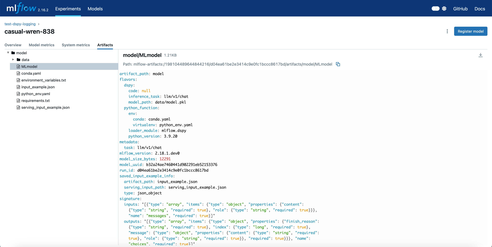

# Tutorial: Deploying your DSPy program

This guide demonstrates two potential ways to deploy your DSPy program in production: FastAPI for lightweight deployments and MLflow for more production-grade deployments with program versioning and management.

Below, we'll assume you have the following simple DSPy program that you want to deploy. You can replace this with something more sophisticated.

```python
import dspy

dspy.configure(lm=dspy.LM("openai/gpt-4o-mini"))
dspy_program = dspy.ChainOfThought("question -> answer")
```

## Deploying with FastAPI

FastAPI offers a straightforward way to serve your DSPy program as a REST API. This is ideal when you have direct access to your program code and need a lightweight deployment solution.

```bash
> pip install fastapi uvicorn
> export OPENAI_API_KEY="your-openai-api-key"
```

Let's create a FastAPI application to serve your `dspy_program` defined above.

```python
from fastapi import FastAPI, HTTPException
from pydantic import BaseModel

import dspy

app = FastAPI(
    title="DSPy Program API",
    description="A simple API serving a DSPy Chain of Thought program",
    version="1.0.0"
)

# Define request model for better documentation and validation
class Question(BaseModel):
    text: str

# Configure your language model and 'asyncify' your DSPy program.
lm = dspy.LM("openai/gpt-4o-mini")
dspy.configure(lm=lm, async_max_workers=4) # default is 8
dspy_program = dspy.ChainOfThought("question -> answer")
dspy_program = dspy.asyncify(dspy_program)

@app.post("/predict")
async def predict(question: Question):
    try:
        result = await dspy_program(question=question.text)
        return {
            "status": "success",
            "data": result.toDict()
        }
    except Exception as e:
        raise HTTPException(status_code=500, detail=str(e))
```

In the code above, we call `dspy.asyncify` to convert the dspy program to run in async mode for high-throughput FastAPI
deployments. Currently, this runs the dspy program in a separate thread and awaits its result.

By default, the limit of spawned threads is 8. Think of this like a worker pool.
If you have 8 in-flight programs and call it once more, the 9th call will wait until one of the 8 returns.
You can configure the async capacity using the new `async_max_workers` setting.

??? "Streaming, in DSPy 2.6.0+"

    Streaming is also supported in DSPy 2.6.0+, which can be installed via `pip install -U dspy`.

    We can use `dspy.streamify` to convert the dspy program to a streaming mode. This is useful when you want to stream
    the intermediate outputs (i.e. O1-style reasoning) to the client before the final prediction is ready. This uses
    asyncify under the hood and inherits the execution semantics.

    ```python
    dspy_program = dspy.asyncify(dspy.ChainOfThought("question -> answer"))
    streaming_dspy_program = dspy.streamify(dspy_program)

    @app.post("/predict/stream")
    async def stream(question: Question):
        async def generate():
            async for value in streaming_dspy_program(question=question.text):
                if isinstance(value, dspy.Prediction):
                    data = {"prediction": value.labels().toDict()}
                elif isinstance(value, litellm.ModelResponse):
                    data = {"chunk": value.json()}
                yield f"data: {ujson.dumps(data)}\n\n"
            yield "data: [DONE]\n\n"

        return StreamingResponse(generate(), media_type="text/event-stream")

    # Since you're often going to want to stream the result of a DSPy program as server-sent events,
    # we've included a helper function for that, which is equivalent to the code above.

    from dspy.utils.streaming import streaming_response

    @app.post("/predict/stream")
    async def stream(question: Question):
        stream = streaming_dspy_program(question=question.text)
        return StreamingResponse(streaming_response(stream), media_type="text/event-stream")
    ```

Write your code to a file, e.g., `fastapi_dspy.py`. Then you can serve the app with:

```bash
> uvicorn fastapi_dspy:app --reload
```

It will start a local server at `http://127.0.0.1:8000/`. You can test it with the python code below:

```python
import requests

response = requests.post(
    "http://127.0.0.1:8000/predict",
    json={"text": "What is the capital of France?"}
)
print(response.json())
```

You should see the response like below:

```json
{
  "status": "success",
  "data": {
    "reasoning": "The capital of France is a well-known fact, commonly taught in geography classes and referenced in various contexts. Paris is recognized globally as the capital city, serving as the political, cultural, and economic center of the country.",
    "answer": "The capital of France is Paris."
  }
}
```

## Deploying with MLflow

We recommend deploying with MLflow if you are looking to package your DSPy program and deploy in an isolated environment.
MLflow is a popular platform for managing machine learning workflows, including versioning, tracking, and deployment.

```bash
> pip install mlflow>=2.18.0
```

Let's spin up the MLflow tracking server, where we will store our DSPy program. The command below will start a local server at
`http://127.0.0.1:5000/`.

```bash
> mlflow ui
```

Then we can define the DSPy program and log it to the MLflow server. "log" is an overloaded term in MLflow, basically it means
we store the program information along with environment requirements in the MLflow server. This is done via the `mlflow.dspy.log_model()`
function, please see the code below:

> [!NOTE]
> As of MLflow 2.22.0, there is a caveat that you must wrap your DSPy program in a custom DSPy Module class when deploying with MLflow.
> This is because MLflow requires positional arguments while DSPy pre-built modules disallow positional arguments, e.g., `dspy.Predict`
> or `dspy.ChainOfThought`. To work around this, create a wrapper class that inherits from `dspy.Module` and implement your program's
> logic in the `forward()` method, as shown in the example below.

```python
import dspy
import mlflow

mlflow.set_tracking_uri("http://127.0.0.1:5000/")
mlflow.set_experiment("deploy_dspy_program")

lm = dspy.LM("openai/gpt-4o-mini")
dspy.configure(lm=lm)

class MyProgram(dspy.Module):
    def __init__(self):
        super().__init__()
        self.cot = dspy.ChainOfThought("question -> answer")

    def forward(self, messages):
        return self.cot(question=messages[0]["content"])

dspy_program = MyProgram()

with mlflow.start_run():
    mlflow.dspy.log_model(
        dspy_program,
        "dspy_program",
        input_example={"messages": [{"role": "user", "content": "What is LLM agent?"}]},
        task="llm/v1/chat",
    )
```

We recommend you to set `task="llm/v1/chat"` so that the deployed program automatically takes input and generate output in
the same format as the OpenAI chat API, which is a common interface for LM applications. Write the code above into
a file, e.g. `mlflow_dspy.py`, and run it.

After you logged the program, you can view the saved information in MLflow UI. Open `http://127.0.0.1:5000/` and select
the `deploy_dspy_program` experiment, then select the run your just created, under the `Artifacts` tab, you should see the
logged program information, similar to the following screenshot:



Grab your run id from UI (or the console print when you execute `mlflow_dspy.py`), now you can deploy the logged program
with the following command:

```bash
> mlflow models serve -m runs:/{run_id}/model -p 6000
```

After the program is deployed, you can test it with the following command:

```bash
> curl http://127.0.0.1:6000/invocations -H "Content-Type:application/json"  --data '{"messages": [{"content": "what is 2 + 2?", "role": "user"}]}'
```

You should see the response like below:

```json
{
  "choices": [
    {
      "index": 0,
      "message": {
        "role": "assistant",
        "content": "{\"reasoning\": \"The question asks for the sum of 2 and 2. To find the answer, we simply add the two numbers together: 2 + 2 = 4.\", \"answer\": \"4\"}"
      },
      "finish_reason": "stop"
    }
  ]
}
```

For complete guide on how to deploy a DSPy program with MLflow, and how to customize the deployment, please refer to the
[MLflow documentation](https://mlflow.org/docs/latest/llms/dspy/index.html).

### Best Practices for MLflow Deployment

1. **Environment Management**: Always specify your Python dependencies in a `conda.yaml` or `requirements.txt` file.
2. **Versioning**: Use meaningful tags and descriptions for your model versions.
3. **Input Validation**: Define clear input schemas and examples.
4. **Monitoring**: Set up proper logging and monitoring for production deployments.

For production deployments, consider using MLflow with containerization:

```bash
> mlflow models build-docker -m "runs:/{run_id}/model" -n "dspy-program"
> docker run -p 6000:8080 dspy-program
```

For a complete guide on production deployment options and best practices, refer to the
[MLflow documentation](https://mlflow.org/docs/latest/llms/dspy/index.html).
