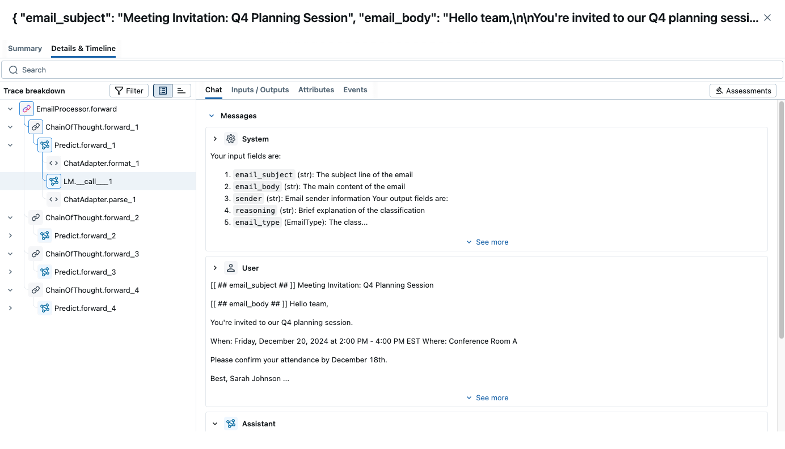

# Extracting Information from Emails with DSPy

This tutorial demonstrates how to build an intelligent email processing system using DSPy. We'll create a system that can automatically extract key information from various types of emails, classify their intent, and structure the data for further processing.

## What You'll Build

By the end of this tutorial, you'll have a DSPy-powered email processing system that can:

- **Classify email types** (order confirmation, support request, meeting invitation, etc.)
- **Extract key entities** (dates, amounts, product names, contact info)
- **Determine urgency levels** and required actions
- **Structure extracted data** into consistent formats
- **Handle multiple email formats** robustly

## Prerequisites

- Basic understanding of DSPy modules and signatures
- Python 3.9+ installed
- OpenAI API key (or access to another supported LLM)

## Installation and Setup

```bash
pip install dspy
```

<details>
<summary>Recommended: Set up MLflow Tracing to understand what's happening under the hood.</summary>

### MLflow DSPy Integration

<a href="https://mlflow.org/">MLflow</a> is an LLMOps tool that natively integrates with DSPy and offer explainability and experiment tracking. In this tutorial, you can use MLflow to visualize prompts and optimization progress as traces to understand the DSPy's behavior better. You can set up MLflow easily by following the four steps below.



1. Install MLflow

```bash
%pip install mlflow>=3.0.0
```

2. Start MLflow UI in a separate terminal
```bash
mlflow ui --port 5000 --backend-store-uri sqlite:///mlruns.db
```

3. Connect the notebook to MLflow
```python
import mlflow

mlflow.set_tracking_uri("http://localhost:5000")
mlflow.set_experiment("DSPy")
```

4. Enabling tracing.
```python
mlflow.dspy.autolog()
```


To learn more about the integration, visit [MLflow DSPy Documentation](https://mlflow.org/docs/latest/llms/dspy/index.html) as well.
</details>

## Step 1: Define Our Data Structures

First, let's define the types of information we want to extract from emails:

```python
import dspy
from typing import List, Optional, Literal
from datetime import datetime
from pydantic import BaseModel
from enum import Enum

class EmailType(str, Enum):
    ORDER_CONFIRMATION = "order_confirmation"
    SUPPORT_REQUEST = "support_request"
    MEETING_INVITATION = "meeting_invitation"
    NEWSLETTER = "newsletter"
    PROMOTIONAL = "promotional"
    INVOICE = "invoice"
    SHIPPING_NOTIFICATION = "shipping_notification"
    OTHER = "other"

class UrgencyLevel(str, Enum):
    LOW = "low"
    MEDIUM = "medium"
    HIGH = "high"
    CRITICAL = "critical"

class ExtractedEntity(BaseModel):
    entity_type: str
    value: str
    confidence: float
```

## Step 2: Create DSPy Signatures

Now let's define the signatures for our email processing pipeline:

```python
class ClassifyEmail(dspy.Signature):
    """Classify the type and urgency of an email based on its content."""

    email_subject: str = dspy.InputField(desc="The subject line of the email")
    email_body: str = dspy.InputField(desc="The main content of the email")
    sender: str = dspy.InputField(desc="Email sender information")

    email_type: EmailType = dspy.OutputField(desc="The classified type of email")
    urgency: UrgencyLevel = dspy.OutputField(desc="The urgency level of the email")
    reasoning: str = dspy.OutputField(desc="Brief explanation of the classification")

class ExtractEntities(dspy.Signature):
    """Extract key entities and information from email content."""

    email_content: str = dspy.InputField(desc="The full email content including subject and body")
    email_type: EmailType = dspy.InputField(desc="The classified type of email")

    key_entities: list[ExtractedEntity] = dspy.OutputField(desc="List of extracted entities with type, value, and confidence")
    financial_amount: Optional[float] = dspy.OutputField(desc="Any monetary amounts found (e.g., '$99.99')")
    important_dates: list[str] = dspy.OutputField(desc="List of important dates found in the email")
    contact_info: list[str] = dspy.OutputField(desc="Relevant contact information extracted")

class GenerateActionItems(dspy.Signature):
    """Determine what actions are needed based on the email content and extracted information."""

    email_type: EmailType = dspy.InputField()
    urgency: UrgencyLevel = dspy.InputField()
    email_summary: str = dspy.InputField(desc="Brief summary of the email content")
    extracted_entities: list[ExtractedEntity] = dspy.InputField(desc="Key entities found in the email")

    action_required: bool = dspy.OutputField(desc="Whether any action is required")
    action_items: list[str] = dspy.OutputField(desc="List of specific actions needed")
    deadline: Optional[str] = dspy.OutputField(desc="Deadline for action if applicable")
    priority_score: int = dspy.OutputField(desc="Priority score from 1-10")

class SummarizeEmail(dspy.Signature):
    """Create a concise summary of the email content."""

    email_subject: str = dspy.InputField()
    email_body: str = dspy.InputField()
    key_entities: list[ExtractedEntity] = dspy.InputField()

    summary: str = dspy.OutputField(desc="A 2-3 sentence summary of the email's main points")
```

## Step 3: Build the Email Processing Module

Now let's create our main email processing module:

```python
class EmailProcessor(dspy.Module):
    """A comprehensive email processing system using DSPy."""

    def __init__(self):
        super().__init__()

        # Initialize our processing components
        self.classifier = dspy.ChainOfThought(ClassifyEmail)
        self.entity_extractor = dspy.ChainOfThought(ExtractEntities)
        self.action_generator = dspy.ChainOfThought(GenerateActionItems)
        self.summarizer = dspy.ChainOfThought(SummarizeEmail)

    def forward(self, email_subject: str, email_body: str, sender: str = ""):
        """Process an email and extract structured information."""

        # Step 1: Classify the email
        classification = self.classifier(
            email_subject=email_subject,
            email_body=email_body,
            sender=sender
        )

        # Step 2: Extract entities
        full_content = f"Subject: {email_subject}\n\nFrom: {sender}\n\n{email_body}"
        entities = self.entity_extractor(
            email_content=full_content,
            email_type=classification.email_type
        )

        # Step 3: Generate summary
        summary = self.summarizer(
            email_subject=email_subject,
            email_body=email_body,
            key_entities=entities.key_entities
        )

        # Step 4: Determine actions
        actions = self.action_generator(
            email_type=classification.email_type,
            urgency=classification.urgency,
            email_summary=summary.summary,
            extracted_entities=entities.key_entities
        )

        # Step 5: Structure the results
        return dspy.Prediction(
            email_type=classification.email_type,
            urgency=classification.urgency,
            summary=summary.summary,
            key_entities=entities.key_entities,
            financial_amount=entities.financial_amount,
            important_dates=entities.important_dates,
            action_required=actions.action_required,
            action_items=actions.action_items,
            deadline=actions.deadline,
            priority_score=actions.priority_score,
            reasoning=classification.reasoning,
            contact_info=entities.contact_info
        )
```

## Step 4: Running the Email Processing System

Let's create a simple function to test our email processing system:

```python
import os
def run_email_processing_demo():
    """Demonstration of the email processing system."""
    
    # Configure DSPy
    lm = dspy.LM(model='openai/gpt-4o-mini')
    dspy.configure(lm=lm)
    os.environ["OPENAI_API_KEY"] = "<YOUR OPENAI KEY>"
    
    # Create our email processor
    processor = EmailProcessor()
    
    # Sample emails for testing
    sample_emails = [
        {
            "subject": "Order Confirmation #12345 - Your MacBook Pro is on the way!",
            "body": """Dear John Smith,

Thank you for your order! We're excited to confirm that your order #12345 has been processed.

Order Details:
- MacBook Pro 14-inch (Space Gray)
- Order Total: $2,399.00
- Estimated Delivery: December 15, 2024
- Tracking Number: 1Z999AA1234567890

If you have any questions, please contact our support team at support@techstore.com.

Best regards,
TechStore Team""",
            "sender": "orders@techstore.com"
        },
        {
            "subject": "URGENT: Server Outage - Immediate Action Required",
            "body": """Hi DevOps Team,

We're experiencing a critical server outage affecting our production environment.

Impact: All users unable to access the platform
Started: 2:30 PM EST

Please join the emergency call immediately: +1-555-123-4567

This is our highest priority.

Thanks,
Site Reliability Team""",
            "sender": "alerts@company.com"
        },
        {
            "subject": "Meeting Invitation: Q4 Planning Session",
            "body": """Hello team,

You're invited to our Q4 planning session.

When: Friday, December 20, 2024 at 2:00 PM - 4:00 PM EST
Where: Conference Room A

Please confirm your attendance by December 18th.

Best,
Sarah Johnson""",
            "sender": "sarah.johnson@company.com"
        }
    ]
    
    # Process each email and display results
    print("🚀 Email Processing Demo")
    print("=" * 50)
    
    for i, email in enumerate(sample_emails):
        print(f"\n📧 EMAIL {i+1}: {email['subject'][:50]}...")
        
        # Process the email
        result = processor(
            email_subject=email["subject"],
            email_body=email["body"],
            sender=email["sender"]
        )
        
        # Display key results
        print(f"   📊 Type: {result.email_type}")
        print(f"   🚨 Urgency: {result.urgency}")
        print(f"   📝 Summary: {result.summary}")
        
        if result.financial_amount:
            print(f"   💰 Amount: ${result.financial_amount:,.2f}")
        
        if result.action_required:
            print(f"   ✅ Action Required: Yes")
            if result.deadline:
                print(f"   ⏰ Deadline: {result.deadline}")
        else:
            print(f"   ✅ Action Required: No")

# Run the demo
if __name__ == "__main__":
    run_email_processing_demo()
```

## Expected Output
```
🚀 Email Processing Demo
==================================================

📧 EMAIL 1: Order Confirmation #12345 - Your MacBook Pro is on...
   📊 Type: order_confirmation
   🚨 Urgency: low
   📝 Summary: The email confirms John Smith's order #12345 for a MacBook Pro 14-inch in Space Gray, totaling $2,399.00, with an estimated delivery date of December 15, 2024. It includes a tracking number and contact information for customer support.
   💰 Amount: $2,399.00
   ✅ Action Required: No

📧 EMAIL 2: URGENT: Server Outage - Immediate Action Required...
   📊 Type: other
   🚨 Urgency: critical
   📝 Summary: The Site Reliability Team has reported a critical server outage that began at 2:30 PM EST, preventing all users from accessing the platform. They have requested the DevOps Team to join an emergency call immediately to address the issue.
   ✅ Action Required: Yes
   ⏰ Deadline: Immediately

📧 EMAIL 3: Meeting Invitation: Q4 Planning Session...
   📊 Type: meeting_invitation
   🚨 Urgency: medium
   📝 Summary: Sarah Johnson has invited the team to a Q4 planning session on December 20, 2024, from 2:00 PM to 4:00 PM EST in Conference Room A. Attendees are asked to confirm their participation by December 18th.
   ✅ Action Required: Yes
   ⏰ Deadline: December 18th
```

## Next Steps

- **Add more email types** and refine classification (newsletter, promotional, etc.)
- **Add integration** with email providers (Gmail API, Outlook, IMAP)
- **Experiment with different LLMs** and optimization strategies
- **Add multilingual support** for international email processing
- **Optimization** for increasing the performance of your program
