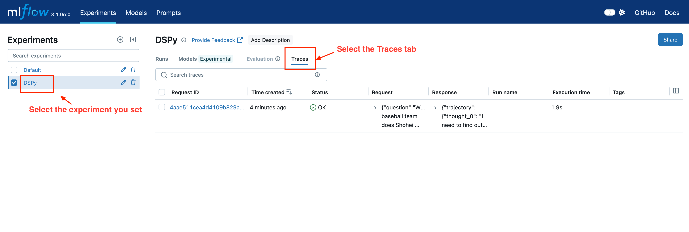
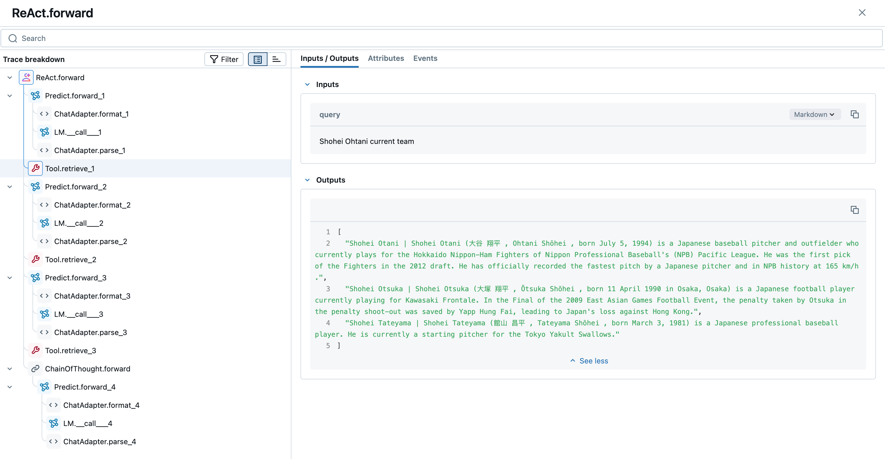

# Tutorial: Debugging and Observability in DSPy

This guide demonstrates how to debug problems and improve observability in DSPy. Modern AI programs often involve multiple components, such as language models, retrievers, and tools. DSPy allows you to build and optimize such complex AI systems in a clean and modular way.

However, as systems grow more sophisticated, the ability to **understand what your system is doing** becomes critical. Without transparency, the prediction process can easily become a black box, making failures or quality issues difficult to diagnose and production maintenance challenging.

By the end of this tutorial, you'll understand how to debug an issue and improve observability using [MLflow Tracing](#tracing). You'll also explore how to build a custom logging solution using callbacks.


## Define a Program

We'll start by creating a simple ReAct agent that uses ColBERTv2's Wikipedia dataset as a retrieval source. You can replace this with a more sophisticated program.

```python
import dspy
import os

os.environ["OPENAI_API_KEY"] = "{your_openai_api_key}"

lm = dspy.LM("openai/gpt-4o-mini")
colbert = dspy.ColBERTv2(url="http://20.102.90.50:2017/wiki17_abstracts")
dspy.configure(lm=lm)


def retrieve(query: str):
    """Retrieve top 3 relevant information from ColBert"""
    results = colbert(query, k=3)
    return [x["text"] for x in results]


agent = dspy.ReAct("question -> answer", tools=[retrieve], max_iters=3)
```

Now, let's ask the agent a simple question:

```python
prediction = agent(question="Which baseball team does Shohei Ohtani play for in June 2025?")
print(prediction.answer)
```

```
Shohei Ohtani is expected to play for the Hokkaido Nippon-Ham Fighters in June 2025, based on the available information.
```

Oh, this is incorrect. He no longer plays for the Hokkaido Nippon-Ham Fighters; he moved to the Dodgers and won the World Series in 2024! Let's debug the program and explore potential fixes.

## Using ``inspect_history``

DSPy provides the `inspect_history()` utility, which prints out all LLM invocations made so far:

```python
# Print out 5 LLM calls
dspy.inspect_history(n=5)
```

```
[2024-12-01T10:23:29.144257]

System message:

Your input fields are:
1. `question` (str)

...

Response:

Response:

[[ ## reasoning ## ]]
The search for information regarding Shohei Ohtani's team in June 2025 did not yield any specific results. The retrieved data consistently mentioned that he plays for the Hokkaido Nippon-Ham Fighters, but there was no indication of any changes or updates regarding his team for the specified date. Given the lack of information, it is reasonable to conclude that he may still be with the Hokkaido Nippon-Ham Fighters unless there are future developments that are not captured in the current data.

[[ ## answer ## ]]
Shohei Ohtani is expected to play for the Hokkaido Nippon-Ham Fighters in June 2025, based on the available information.

[[ ## completed ## ]]

```
The log reveals that the agent could not retrieve helpful information from the search tool. However, what exactly did the retriever return? While useful, `inspect_history` has some limitations:

* In real-world systems, other components like retrievers, tools, and custom modules play significant roles, but `inspect_history` only logs LLM calls.
* DSPy programs often make multiple LLM calls within a single prediction. Monolith log history makes it hard to organize logs, especially when handling multiple questions.
* Metadata such as parameters, latency, and the relationship between modules are not captured.

**Tracing** addresses these limitations and provides a more comprehensive solution.

## Tracing

[MLflow](https://mlflow.org/docs/latest/llms/tracing/index.html) is an end-to-end machine learning platform that is integrated seamlessly with DSPy to support best practices in LLMOps. Using MLflow's automatic tracing capability with DSPy is straightforward; **No sign up for services or an API key is required**. You just need to install MLflow and call `mlflow.dspy.autolog()` in your notebook or script.

```bash
pip install -U mlflow>=2.18.0
```

After installation, spin up your server via the command below.

```
# It is highly recommended to use SQL store when using MLflow tracing
mlflow server --backend-store-uri sqlite:///mydb.sqlite
```

If you don't specify a different port via `--port` flag, you MLflow server will be hosted at port 5000.

Now let's change our code snippet to enable MLflow tracing. We need to:

- Tell MLflow where the server is hosted.
- Apply `mlflow.autolog()` so that DSPy tracing is automatically captured.

The full code is as below, now let's run it again!

```python
import dspy
import os
import mlflow

os.environ["OPENAI_API_KEY"] = "{your_openai_api_key}"

# Tell MLflow about the server URI.
mlflow.set_tracking_uri("http://127.0.0.1:5000")
# Create a unique name for your experiment.
mlflow.set_experiment("DSPy")

lm = dspy.LM("openai/gpt-4o-mini")
colbert = dspy.ColBERTv2(url="http://20.102.90.50:2017/wiki17_abstracts")
dspy.configure(lm=lm)


def retrieve(query: str):
    """Retrieve top 3 relevant information from ColBert"""
    results = colbert(query, k=3)
    return [x["text"] for x in results]


agent = dspy.ReAct("question -> answer", tools=[retrieve], max_iters=3)
print(agent(question="Which baseball team does Shohei Ohtani play for?"))
```


MLflow automatically generates a **trace** for each prediction and records it within your experiment. To explore these traces visually, open `http://127.0.0.1:5000/`
in your browser, then select the experiment you just created and navigate to the Traces tab:



Click on the most recent trace to view its detailed breakdown:



Here, you can examine the input and output of every step in your workflow. For example, the screenshot above shows the `retrieve` function's input and output. By inspecting the retriever's output, you can see that it returned outdated information, which is not sufficient to determine which team Shohei Ohtani plays for in June 2025. You can also inspect
other steps, e.g, language model's input, output, and configuration.

To address the issue of outdated information, you can replace the `retrieve` function with a web search tool powered by [Tavily search](https://www.tavily.com/).

```python
from tavily import TavilyClient
import dspy
import mlflow

# Tell MLflow about the server URI.
mlflow.set_tracking_uri("http://127.0.0.1:5000")
# Create a unique name for your experiment.
mlflow.set_experiment("DSPy")

search_client = TavilyClient(api_key="<YOUR_TAVILY_API_KEY>")

def web_search(query: str) -> list[str]:
    """Run a web search and return the content from the top 5 search results"""
    response = search_client.search(query)
    return [r["content"] for r in response["results"]]

agent = dspy.ReAct("question -> answer", tools=[web_search])

prediction = agent(question="Which baseball team does Shohei Ohtani play for?")
print(agent.answer)
```

```
Los Angeles Dodgers
```

Below is a GIF demonstrating how to navigate through the MLflow UI:


For a complete guide on how to use MLflow tracing, please refer to
the [MLflow Tracing Guide](https://mlflow.org/docs/3.0.0rc0/tracing).


!!! info Learn more about MLflow

    MLflow is an end-to-end LLMOps platform that offers extensive features like experiment tracking, evaluation, and deployment. To learn more about DSPy and MLflow integration, visit [this tutorial](../deployment/index.md#deploying-with-mlflow).


## Building a Custom Logging Solution

Sometimes, you may want to implement a custom logging solution. For instance, you might need to log specific events triggered by a particular module. DSPy's **callback** mechanism supports such use cases. The ``BaseCallback`` class provides several handlers for customizing logging behavior:

|Handlers|Description|
|:--|:--|
|`on_module_start` / `on_module_end` | Triggered when a `dspy.Module` subclass is invoked. |
|`on_lm_start` / `on_lm_end` | Triggered when a `dspy.LM` subclass is invoked. |
|`on_adapter_format_start` / `on_adapter_format_end`| Triggered when a `dspy.Adapter` subclass formats the input prompt. |
|`on_adapter_parse_start` / `on_adapter_parse_end`| Triggered when a `dspy.Adapter` subclass postprocess the output text from an LM. |
|`on_tool_start` / `on_tool_end` | Triggered when a `dspy.Tool` subclass is invoked. |
|`on_evaluate_start` / `on_evaluate_end` | Triggered when a `dspy.Evaluate` instance is invoked. |

Here's an example of custom callback that logs the intermediate steps of a ReAct agent:

```python
import dspy
from dspy.utils.callback import BaseCallback

# 1. Define a custom callback class that extends BaseCallback class
class AgentLoggingCallback(BaseCallback):

    # 2. Implement on_module_end handler to run a custom logging code.
    def on_module_end(self, call_id, outputs, exception):
        step = "Reasoning" if self._is_reasoning_output(outputs) else "Acting"
        print(f"== {step} Step ===")
        for k, v in outputs.items():
            print(f"  {k}: {v}")
        print("\n")

    def _is_reasoning_output(self, outputs):
        return any(k.startswith("Thought") for k in outputs.keys())

# 3. Set the callback to DSPy setting so it will be applied to program execution
dspy.configure(callbacks=[AgentLoggingCallback()])
```


```
== Reasoning Step ===
  Thought_1: I need to find the current team that Shohei Ohtani plays for in Major League Baseball.
  Action_1: Search[Shohei Ohtani current team 2023]

== Acting Step ===
  passages: ["Shohei Ohtani ..."]

...
```

!!! info Handling Inputs and Outputs in Callbacks

    Be cautious when working with input or output data in callbacks. Mutating them in-place can modify the original data passed to the program, potentially leading to unexpected behavior. To avoid this, it's strongly recommended to create a copy of the data before performing any operations that may alter it.
