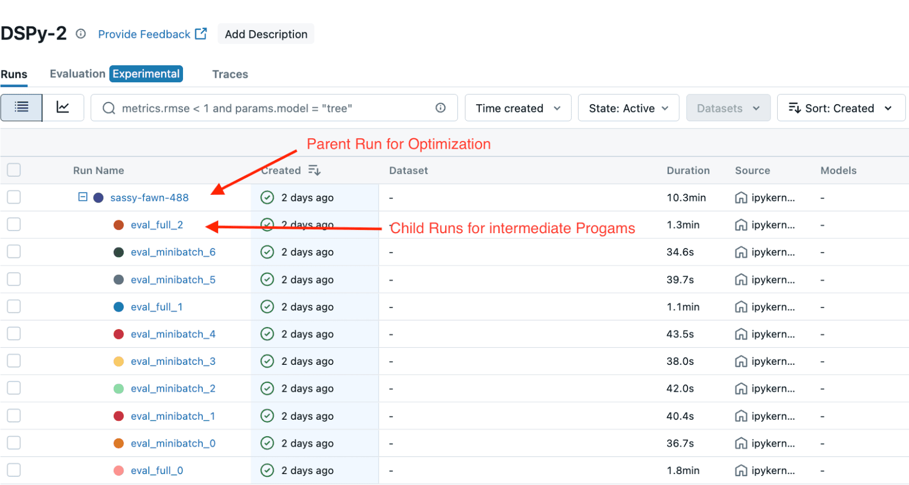
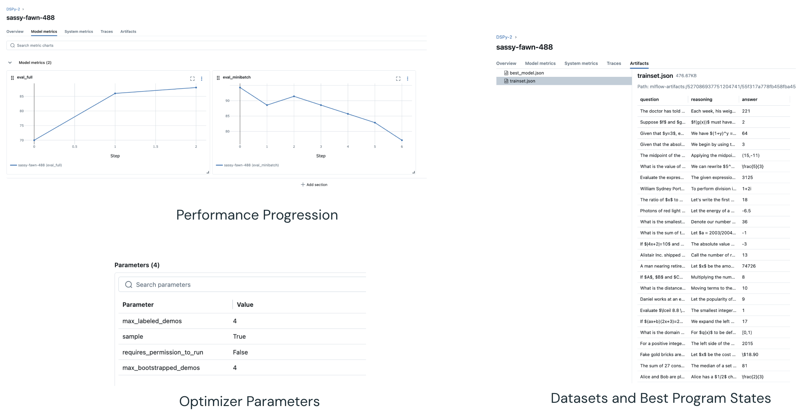
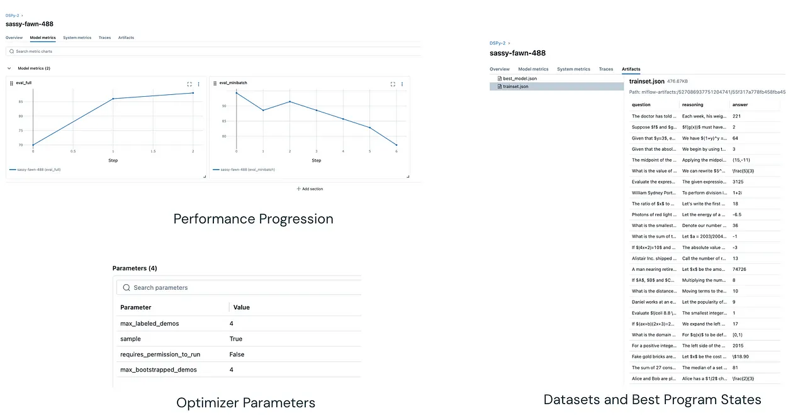

# Tracking DSPy Optimizers with MLflow

This tutorial demonstrates how to use MLflow to track and analyze your DSPy optimization process. MLflow's built-in integration for DSPy provides traceability and debuggability for your DSPy optimization experience. It allows you to understand the intermediate trials during the optimization, store the optimized program and its results, and provides observability into your program execution.

Through the autologging capability, MLflow tracks the following information:

* **Optimizer Parameters**
    * Number of few-shot examples
    * Number of candidates
    * Other configuration settings

* **Program States**
    * Initial instructions and few-shot examples
    * Optimized instructions and few-shot examples
    * Intermediate instructions and few-shot examples during optimization

* **Datasets**
    * Training data used
    * Evaluation data used

* **Performance Progression**
    * Overall metric progression
    * Performance at each evaluation step

* **Traces**
    * Program execution traces
    * Model responses
    * Intermediate prompts

## Getting Started

### 1. Install MLflow
First, install MLflow (version 2.21.1 or later):

```bash
pip install mlflow>=2.21.1
```

### 2. Start MLflow Tracking Server

Let's spin up the MLflow tracking server with the following command. This will start a local server at `http://127.0.0.1:5000/`:

```bash
# It is highly recommended to use SQL store when using MLflow tracing
mlflow server --backend-store-uri sqlite:///mydb.sqlite
```

### 3. Enable Autologging

Configure MLflow to track your DSPy optimization:

```python
import mlflow
import dspy

# Enable autologging with all features
mlflow.dspy.autolog(
    log_compiles=True,    # Track optimization process
    log_evals=True,       # Track evaluation results
    log_traces_from_compile=True  # Track program traces during optimization
)

# Configure MLflow tracking
mlflow.set_tracking_uri("http://localhost:5000")  # Use local MLflow server
mlflow.set_experiment("DSPy-Optimization")
```

### 4. Optimizing Your Program

Here's a complete example showing how to track the optimization of a math problem solver:

```python
import dspy
from dspy.datasets.gsm8k import GSM8K, gsm8k_metric

# Configure your language model
lm = dspy.LM(model="openai/gpt-4o")
dspy.configure(lm=lm)

# Load dataset
gsm8k = GSM8K()
trainset, devset = gsm8k.train, gsm8k.dev

# Define your program
program = dspy.ChainOfThought("question -> answer")

# Create and run optimizer with tracking
teleprompter = dspy.teleprompt.MIPROv2(
    metric=gsm8k_metric,
    auto="light",
)

# The optimization process will be automatically tracked
optimized_program = teleprompter.compile(
    program,
    trainset=trainset,
)
```

### 5. Viewing Results

Once your optimization is complete, you can analyze the results through MLflow's UI. Let's walk through how to explore your optimization runs.

#### Step 1: Access the MLflow UI
Navigate to `http://localhost:5000` in your web browser to access the MLflow tracking server UI.

#### Step 2: Understanding the Experiment Structure
When you open the experiment page, you'll see a hierarchical view of your optimization process. The parent run represents your overall optimization process, while the child runs show each intermediate version of your program that was created during optimization.



#### Step 3: Analyzing the Parent Run
Clicking on the parent run reveals the big picture of your optimization process. You'll find detailed information about your optimizer's configuration parameters and how your evaluation metrics progressed over time. The parent run also stores your final optimized program, including the instructions, signature definitions, and few-shot examples that were used. Additionally, you can review the training data that was used during the optimization process.



#### Step 4: Examining Child Runs
Each child run provides a detailed snapshot of a specific optimization attempt. When you select a child run from the experiment page, you can explore several aspects of that particular intermediate program.
On the run parameter tab or artifact tab, you can review the instructions and few-shot examples used for the intermediate program.
One of the most powerful features is the Traces tab, which provides a step-by-step view of your program's execution. Here you can understand exactly how your DSPy program processes inputs and generates outputs.



### 6. Loading Models for Inference
You can load the optimized program directly from the MLflow tracking server for inference:

```python
model_path = mlflow.artifacts.download_artifacts("mlflow-artifacts:/path/to/best_model.json")
program.load(model_path)
```

## Troubleshooting

- If traces aren't appearing, ensure `log_traces_from_compile=True`
- For large datasets, consider setting `log_traces_from_compile=False` to avoid memory issues
- Use `mlflow.get_run(run_id)` to programmatically access MLflow run data

For more features, explore the [MLflow Documentation](https://mlflow.org/docs/latest/llms/dspy).
