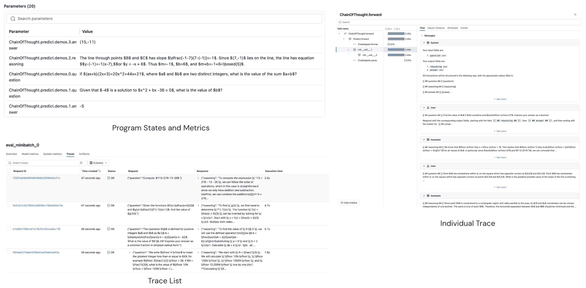

# Tracking DSPy Optimizers with MLflow

This tutorial demonstrates how to use MLflow to track and analyze your DSPy optimization process. MLflow's built-in integration for DSPy provides traceability and debuggability for your DSPy optimization experience. It allows you to understand the intermediate trials during the optimization, store the optimized program and its results, and provides observability into your program execution.

Through the autologging capability, MLflow tracks the following information:

* **Optimizer Parameters**
    * Number of demonstrations
    * Number of candidates
    * Other configuration settings

* **Program States**
    * Initial program state
    * Optimized program state
    * Intermediate states during optimization

* **Datasets**
    * Training data used
    * Evaluation data used

* **Performance Progression**
    * Overall metric progression
    * Performance at each evaluation step

* **Traces**
    * Program execution traces
    * Model responses
    * Intermediate prompts

## Getting Started

### 1. Install MLflow
First, install MLflow (version 2.21.1 or later):

```bash
pip install mlflow>=2.21.1
```

### 2. Start MLflow Tracking Server

Let's spin up the MLflow tracking server with the following command. This will start a local server at `http://127.0.0.1:5000/`:

```bash
mlflow server --backend-store-uri sqlite:///mydb.sqlite
```

### 3. Enable Autologging

Configure MLflow to track your DSPy optimization:

```python
import mlflow
import dspy

# Enable autologging with all features
mlflow.dspy.autolog(
    log_compiles=True,    # Track optimization process
    log_evals=True,       # Track evaluation results
    log_traces_from_compile=True  # Track program traces during optimization
)

# Configure MLflow tracking
mlflow.set_tracking_uri("http://localhost:5000")  # Use local MLflow server
mlflow.set_experiment("DSPy-Optimization")
```

### 4. Optimizing Your Program

Here's a complete example showing how to track the optimization of a math problem solver:

```python
import dspy
from dspy.datasets.gsm8k import GSM8K, gsm8k_metric

# Configure your language model
lm = dspy.LM(model="openai/gpt-3.5-turbo")
dspy.configure(lm=lm)

# Load dataset
gsm8k = GSM8K()
trainset, devset = gsm8k.train, gsm8k.dev[:50]

# Define your program
program = dspy.ChainOfThought("question -> answer")

# Create and run optimizer with tracking
teleprompter = dspy.teleprompt.MIPROv2(
    metric=gsm8k_metric,
    auto="light",
)

# The optimization process will be automatically tracked
optimized_program = teleprompter.compile(
    program,
    trainset=trainset,
)
```

### 5. Viewing Results
Open `http://localhost:5000` in your browser to visit the MLflow tracking server UI. Then navigate to your experiment to see:

- Parent runs (optimization process)
- Child runs (individual evaluations)
- Metrics progression
- Artifacts and program states



### 6. Loading Models for Inference
You can load the optimized program directly from the MLflow tracking server for inference:

```python
model_path = mlflow.artifacts.download_artifacts("mlflow-artifacts:/path/to/best_model.json")
program.load(model_path)
```

## Troubleshooting

- If traces aren't appearing, ensure `log_traces_from_compile=True`
- For large datasets, consider setting `log_traces_from_compile=False` to avoid memory issues
- Use `mlflow.get_run(run_id)` to programmatically access MLflow run data

For more features, explore the [MLflow Documentation](https://mlflow.org/docs/latest/llms/dspy).
